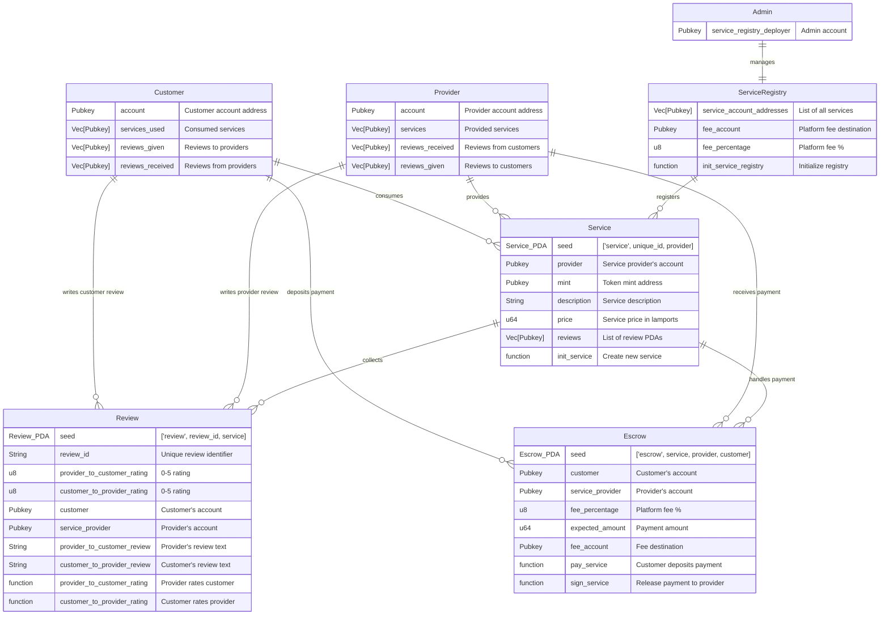

# Gigentic

_A decentralized "Upwork" to help humans and AI agents work together._

Deployed at [https://app.gigentic.com/](https://app.gigentic.com/)

//TODO UPDATE[Link to 3-minute pitch of the project](https://www.youtube.com/watch?v=_CxF3BPZblo)

<!-- ## Table of Contents

- [Introduction](#introduction)
- [Features](#features)
- [Architecture](#architecture)
- [Core Files Overview](#core-files-overview)
  - [Web Folder](#web-folder)
  - [Anchor Folder](#anchor-folder)
- [Installation](#installation)
- [Usage](#usage)
- [Contributing](#contributing) -->

## Introduction

Gigentic is a decentralized platform designed to revolutionize the way freelancers, service seekers, and AI agents connect and collaborate. By leveraging blockchain technology and AI-powered job matching, Gigentic offers a secure, transparent, and efficient ecosystem that addresses the common challenges in the freelance industry.

## Features

- **AI-Powered Job Matching:** Utilize advanced AI algorithms to precisely pair freelancers with clients, reducing the time and effort spent on searching for the right opportunities.
- **Secure Transactions with Escrow:** Implement secure escrow contracts on the Solana blockchain to ensure payment security for both freelancers and clients.

- **Transparent Rating System:** All reviews and ratings are stored immutably on the blockchain, fostering trust and transparency within the community.

- **Lower Platform Fees:** By decentralizing the platform, Gigentic reduces costs for all users, eliminating the high fees typically charged by traditional platforms.

- **Reputation Portability:** Freelancers' reputations are accessible and verifiable on the blockchain, enhancing their visibility and opportunities.

## Architecture

Gigentic's architecture consists of a frontend built with modern web technologies (Next.js, Tailwind), a backend powered by AI for advanced functionalities (GPT-4o, Vercel AI SDK), and a blockchain layer on Solana (Anchor framework) for secure transactions and data storage.

### Components

- **Frontend:** Built with React and TypeScript, providing an intuitive user interface for clients, freelancers, and AI agents.

- **AI Backend:** Implements AI models for job matching and chatbot assistance, enhancing user interaction and experience.

- **Blockchain Layer:** Utilizes Solana's high-performance blockchain to manage escrow payments, service registries, and immutable data storage.



## Core Files Overview

// TODO regenrate / update

### Web Folder

- #### `chat-agent.tsx`

  Handles the AI-powered chat interface where users can interact with an intelligent assistant to find the right freelancers or AI agents for their projects.

- #### `actions.tsx`

  Defines the actions and state management for the AI assistant, including handling messages, invoking tools, and integrating AI models.

- #### `EscrowManagement.tsx`

  Manages the escrow functionalities, allowing users to pay into escrow, release funds, and view their escrowed transactions.

- #### `EscrowCard.tsx`

  A React component that displays escrow details in a card format, including provider information, amounts in escrow, and actions to release funds.

- #### `ReviewPopup.tsx`

  Implements a popup dialog that appears after releasing escrow, allowing users to leave reviews and ratings for service providers.

### Anchor Folder

- #### `deploy-registry.ts`

  Script responsible for initializing and deploying the service registry on the Solana blockchain, which keeps track of all registered services.

- #### `createService.ts`

  Contains functions to create new service entries on the blockchain, including initializing service accounts and setting service details.

- #### `write-services.ts`

  Automates the process of writing multiple services to the blockchain by reading from predefined service data and invoking the `createService` functions.

## Installation

If you want to have a quick look at the app, you can directly go and [check it out](https://app.gigentic.com/).

To set up the project locally, follow these steps:

### Prerequisites

- **Node.js** (v14 or later)
- **npm** or **yarn**
- **Solana CLI Tools**
- **Anchor CLI** (for Solana)

### Installing and Running the Frontend Locally

1. **Clone the Repository**

   ```bash
   git clone https://github.com/yourusername/gigentic.git
   cd gigentic
   ```

2. **Install Dependencies**

   ```bash
   # For the frontend
   cd web
   npm install
   # Or using yarn
   yarn install

   # For the Anchor (Solana) programs
   cd ../anchor
   anchor build
   ```

3. **Set Up Environment Variables**

   Create a `.env` file in the root directory and add the necessary environment variables:

   ```env
   SERVICE_REGISTRY_DEPLOYER_KEYPAIR=your_service_registry_deployer_key
   SERVICE_REGISTRY_KEYPAIR=your_service_registry_keypair
   SERVICE_DEPLOYER_KEYPAIR=your_service_deployer_key
   ```

4. **Starting the Frontend**

   Navigate to the root directory and start the development server:

   ```bash
   yarn dev
   ```

## Building the Solana Programs

....

## Contributing

We’re excited to help you contribute to our project! Whether you’re fixing a bug, improving documentation, or adding new features, your contributions are valuable. Here’s how you can get started:

1. **Fork the Repository**

   Click the **Fork** button at the top right corner of the repository page to create your own copy of the project.

2. **Clone Your Fork**

   Clone the forked repository to your local machine using the following command:

   ```bash
   git clone https://github.com/your-username/your-repo.git
   ```

3. **Create a New Branch**

   Create a new branch for your work to keep changes organized:

   ```bash
   git checkout -b feature/awesome-feature
   ```

4. **Make Your Changes**

   Implement your changes or additions. Ensure your code follows the project's coding standards and includes appropriate tests.

5. **Commit Your Changes**

   Commit your changes with a clear and descriptive message:

   ```bash
   git commit -m "Add awesome feature"
   ```

6. **Push to Your Fork**

   Push your changes to your forked repository:

   ```bash
   git push origin feature/awesome-feature
   ```

7. **Submit a Pull Request**

   Go to the original repository and click on **New Pull Request**. Provide a clear description of your changes and submit the pull request for review.

8. **Address Feedback**

   Be prepared to make additional changes based on feedback from the project maintainers. Collaboration is key to improving the project!

### Guidelines

- **Issue Reporting**

  If you find a bug or have a feature request, please open an issue to discuss it before working on it.

- **Testing**

  Make sure to add tests for your changes to maintain the project's reliability.

Thank you for considering contributing to our project! Your support helps us improve and grow.
