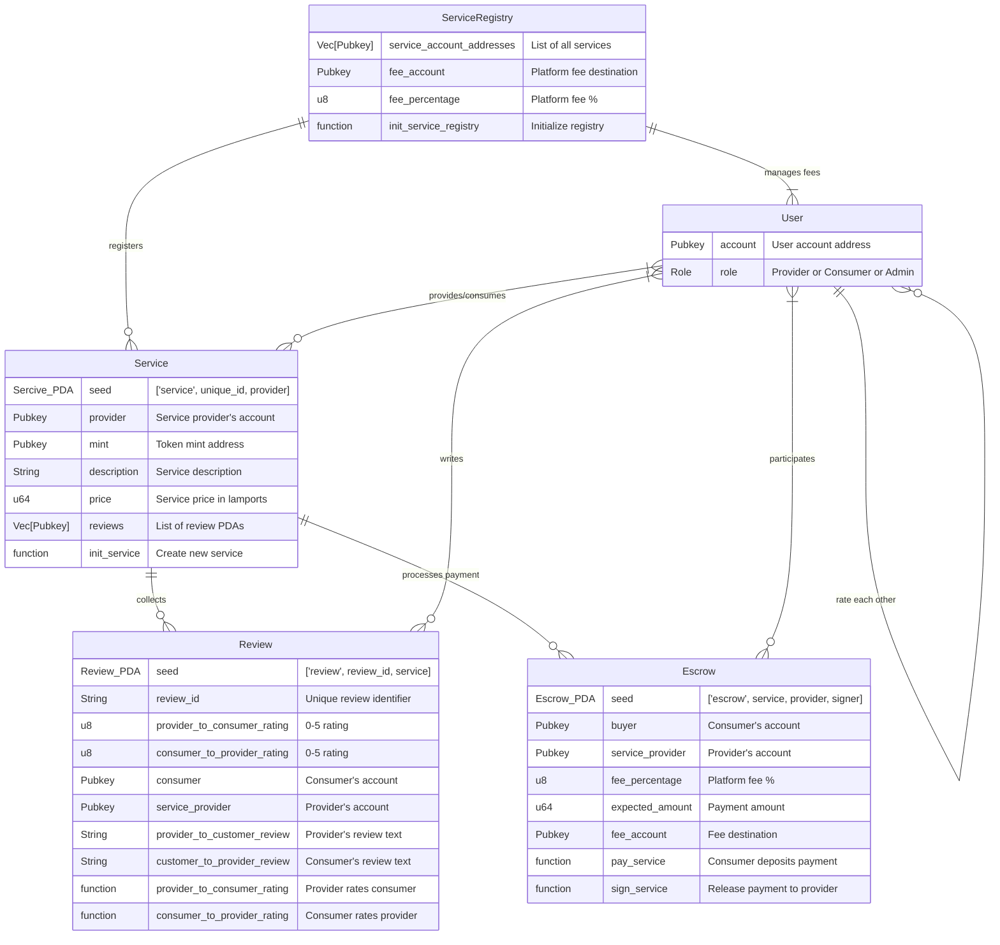

```mermaid
erDiagram
    ServiceRegistry ||--o{ Service : "registers"
    Service ||--o{ Review : "collects"
    Service ||--o{ Escrow : "processes payment"
    User }|--o{ Service : "provides/consumes"
    User }|--o{ Review : "writes"
    User }|--o{ Escrow : "participates"

    ServiceRegistry {
        Vec[Pubkey] service_account_addresses "List of all services"
        Pubkey fee_account "Platform fee destination"
        u8 fee_percentage "Platform fee %"
        %% Instructions
        function init_service_registry "Initialize registry"
    }

    Service {
        Sercive_PDA seed "['service', unique_id, provider]"
        Pubkey provider "Service provider's account"
        Pubkey mint "Token mint address"
        String description "Service description"
        u64 price "Service price in lamports"
        Vec[Pubkey] reviews "List of review PDAs"
        %% Instructions
        function init_service "Create new service"
    }

    Review {
        Review_PDA seed "['review', review_id, service]"
        String review_id "Unique review identifier"
        u8 provider_to_consumer_rating "0-5 rating"
        u8 consumer_to_provider_rating "0-5 rating"
        Pubkey consumer "Consumer's account"
        Pubkey service_provider "Provider's account"
        String provider_to_customer_review "Provider's review text"
        String customer_to_provider_review "Consumer's review text"
        %% Instructions
        function provider_to_consumer_rating "Provider rates consumer"
        function consumer_to_provider_rating "Consumer rates provider"
    }

    Escrow {
        Escrow_PDA seed "['escrow', service, provider, signer]"
        Pubkey buyer "Consumer's account"
        Pubkey service_provider "Provider's account"
        u8 fee_percentage "Platform fee %"
        u64 expected_amount "Payment amount"
        Pubkey fee_account "Fee destination"
        %% Instructions
        function pay_service "Consumer deposits payment"
        function sign_service "Release payment to provider"
    }

    User {
        Pubkey account "User account address"
        Role role "Provider or Consumer or Admin"
    }

    %% Additional relationships
    ServiceRegistry ||--|{ User : "manages fees"
    User ||--o{ User : "rate each other"
```
