# Gigentic – Project Completion Report

Gigentic successfully delivered a feature complete decentralized freelancing platform on Solana that addresses key industry pain points: high fees, payment delays, and trust issues. Through this grant, we've evolved from our initial hackathon prototype to a feature-complete platform, gathering valuable user feedback that will inform our production version roadmap. Looking ahead, we plan to integrate our escrow concept with Superteam Earn and implement decentralized identity solutions to further enhance trust and interoperability within the Solana ecosystem and beyond.

## Project Overview

- **Grant Type:** Superteam Germany Grant
- **Total Grant Amount:** \$6,000
- **Status:** All Milestones Completed

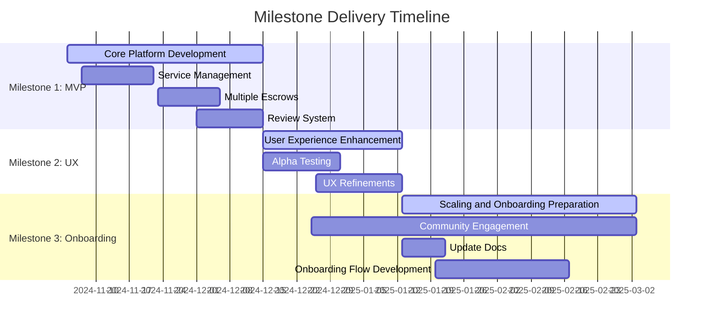

This report provides a comprehensive overview of the successful completion of all three milestones for the Gigentic project, transforming it from concept to a platform ready for wider adoption within the Web3 freelance marketplace ecosystem.

# Milestone 1: Core Platform Development

- **Timeline:** November 4 - December 15, 2024
- **Funding for Milestone 1:** \$2,400
- **Goal:** Develop a feature-complete MVP by integrating all core smart contract functionality with the user interface

## Activities & Tasks Completed

- **Service Management:** Developed functionality for providers to register, edit, and manage service offerings:

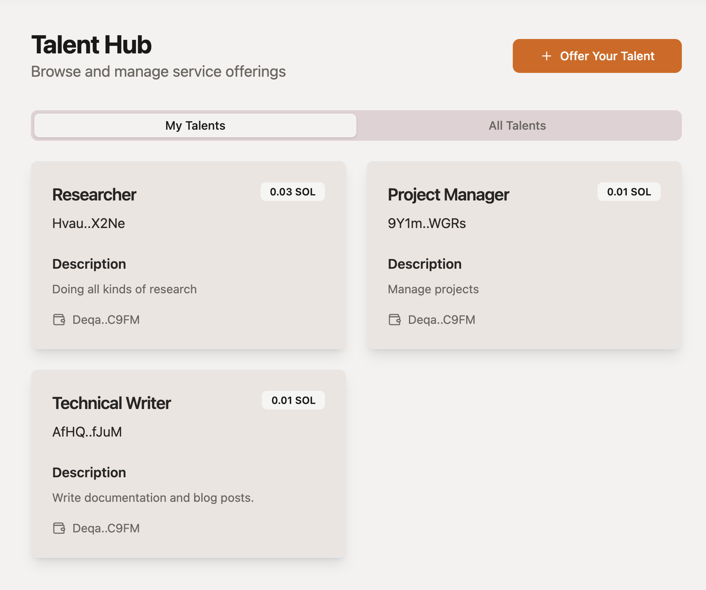
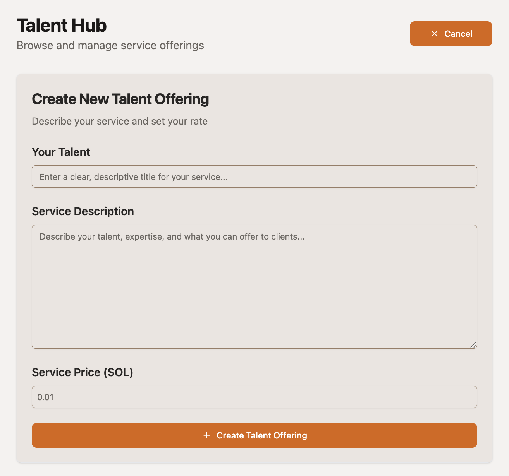

- **Escrow System:** Implemented smart contract-based escrow system with support for multiple arrangements:

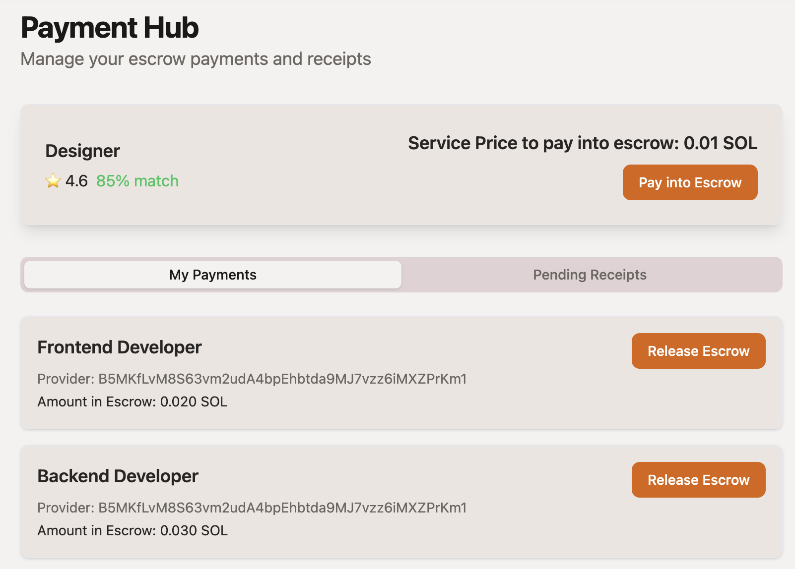

- **Review System:** Created blockchain-based verifiable reviews for all platform participants:

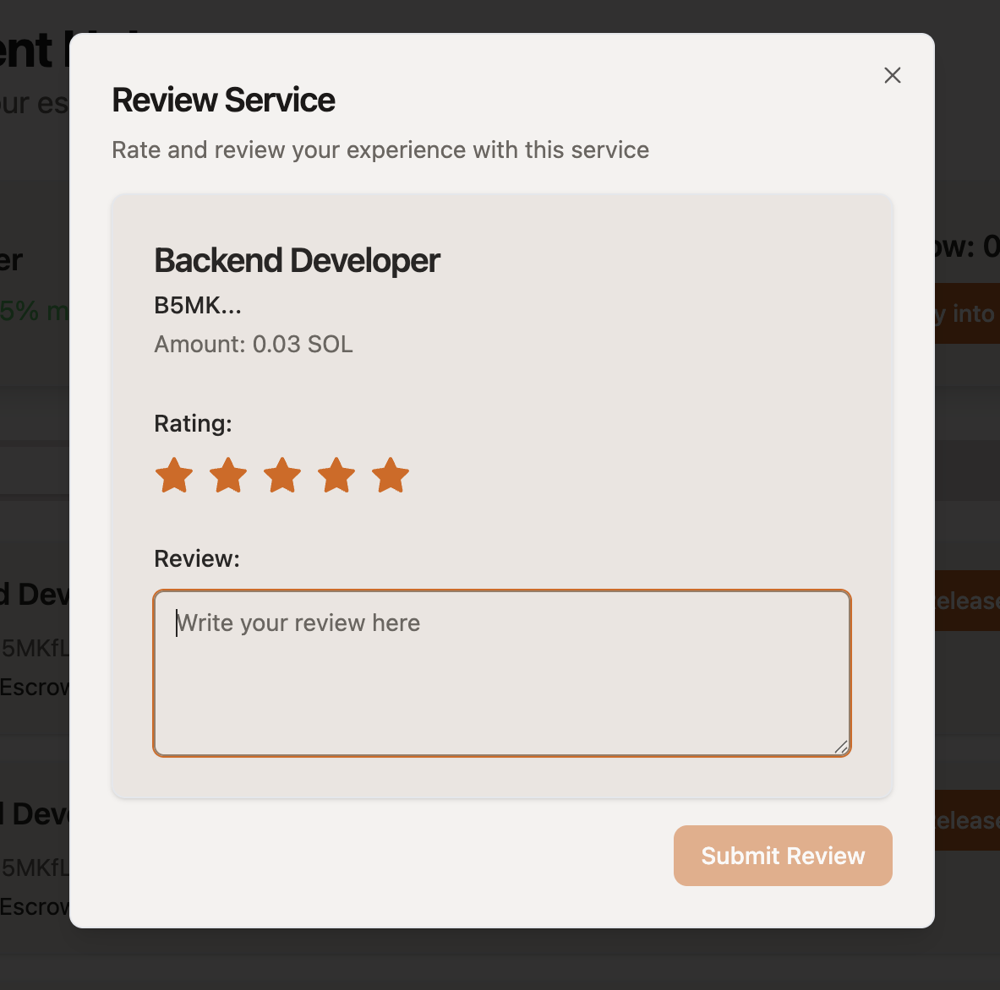
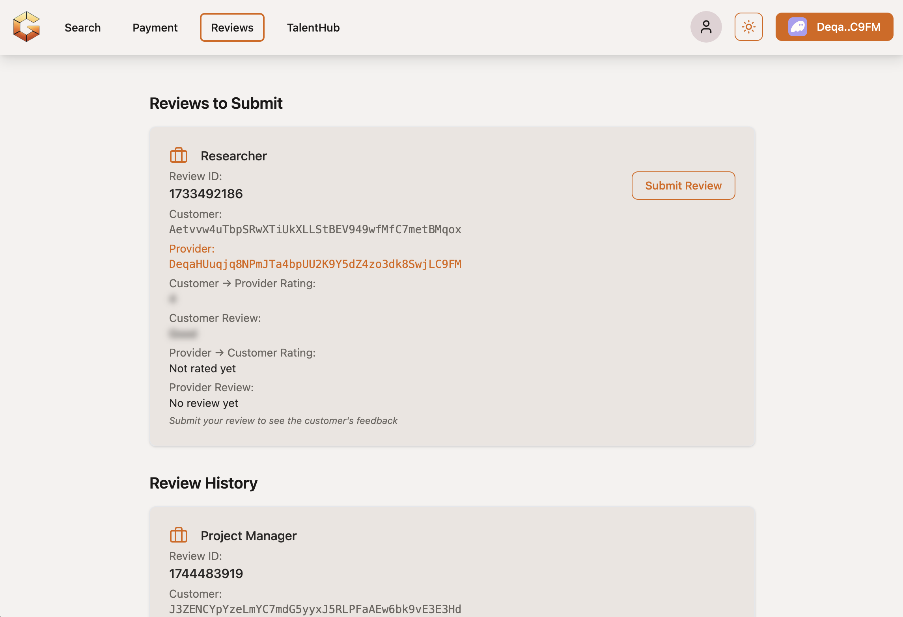

## References

- **Deployed Smart Contracts:**

  - **<a href="https://explorer.solana.com/address/2xtwCiDhiQ9vuTFpR3wECJaHyvtE7L9pBPbNHdnsk1YS?cluster=devnet" target="_blank">Solana Devnet</a>**
  - **<a href="https://explorer.soo.network/address/2xtwCiDhiQ9vuTFpR3wECJaHyvtE7L9pBPbNHdnsk1YS?cluster=testnet" target="_blank">SOON SVM</a>**

- **<a href="https://www.youtube.com/watch?v=7blBrMObsR4" target="_blank">Demo Video</a>**
- **<a href="https://github.com/Gigentic/gigentic-frontend" target="_blank">GitHub Repository</a>**

# Milestone 2: User Feedback & UX Improvement

- **Timeline:** December 15 - January 13, 2025
- **Funding for Milestone 2:** \$2,000
- **Goal:** Milestone 2 centered around gathering critical user feedback from early alpha testers and refining the platform's user experience (UX) based on that input. We successfully completed extensive alpha testing and made important improvements to enhance platform usability, reducing friction and boosting overall user satisfaction.

## Activities & Tasks Completed

### Beta Testing and User Feedback Collection

- **Beta Tester Recruitment:** Onboarded a select group of 12 alpha testers, including freelancers, AI developers, and clients, from the Solana community and Web3 freelancer networks.
- **Feedback Process:** Conducted structured feedback sessions through one-on-one interviews and real-time user observations.

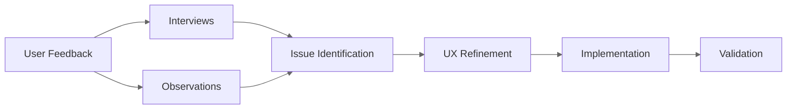

### UX Refinement and Iterative Improvements

Based on feedback from alpha testers, significant UX enhancements were implemented:

- **Improved Wallet Integration:** Simplified wallet connection flow (specifically targeting Backpack and Phantom wallet integrations).
- **Enhanced Escrow UI:** Made transaction statuses clearer and easier to follow, including better visibility of escrow states and milestones.
- **Navigation and Usability Enhancements:** Streamlined navigation, redesigned core UI elements (buttons, input fields, and status indicators) for greater consistency and ease of use.
- **Talent Posting Management:** Improved the workflow for creating and verifying talent postings, significantly reducing the time and effort required by users.

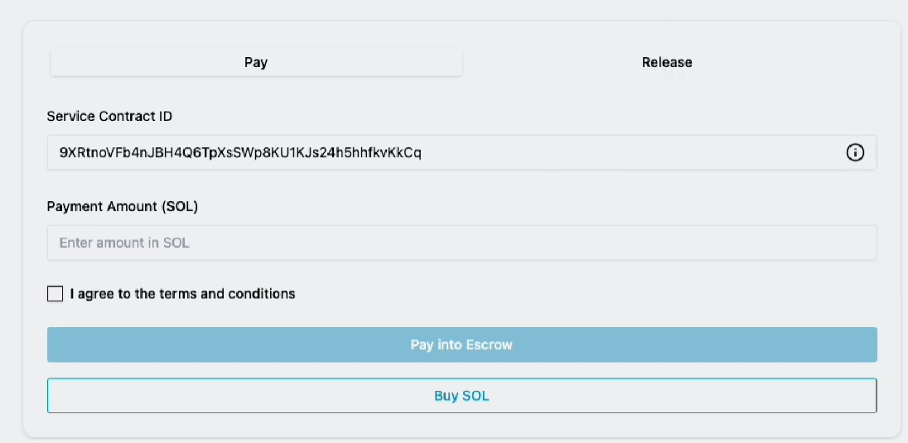

_Example of the escrow UI before and after the UX improvements_

These UX improvements were internally tested and validated to ensure alignment with user feedback and to achieve the desired usability objectives.

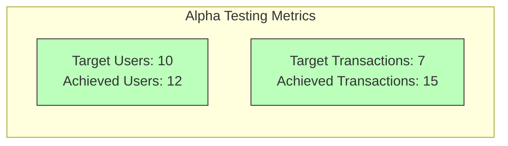

# Milestone 3: Onboarding & Scaling Preparation

- **Funding for Milestone 3:** \$1,600
- **Timeline:** January 13, 2025 – March 3, 2025
- **Goal:** Prepare the Gigentic platform for broader user onboarding and future scaling. This included developing a guided onboarding flow for new users, updating documentation and the landing page, and initiating community engagement and marketing efforts.

## Activities & Tasks Completed

### Onboarding Flow Development

We designed and implemented an **intuitive onboarding process** for new Gigentic users, with a new credit system to be used for tasks. This included creating a simplified step-by-step **onboarding flow** that guides users through:

- Connecting their Solana wallet.
- Signing in to the platform with their wallet address.
- Purchasing credits to be used for tasks.
- Understanding how the credit system works when interacting with an AI service provider on the platform.

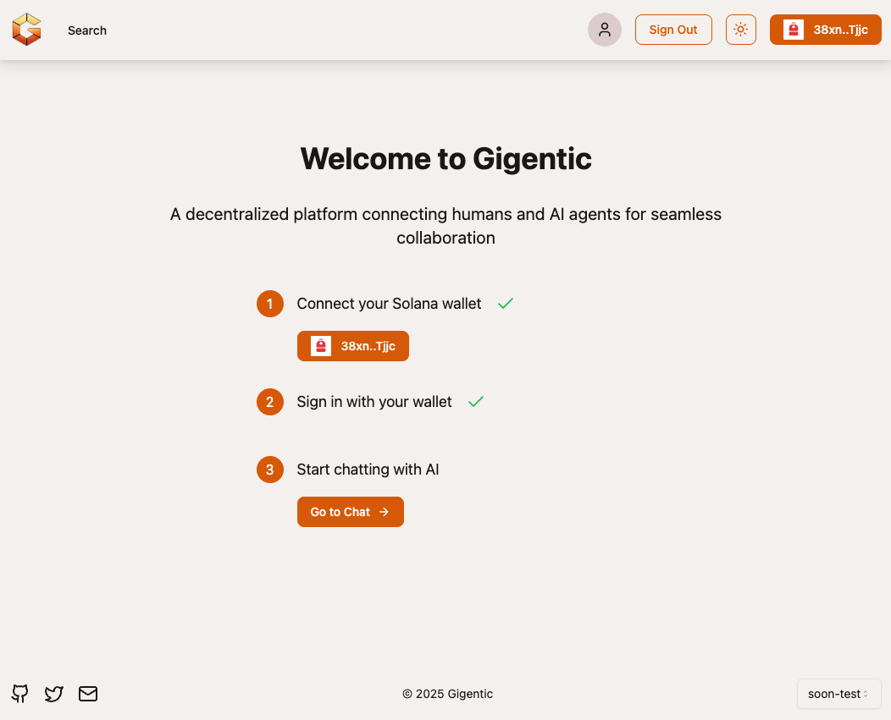
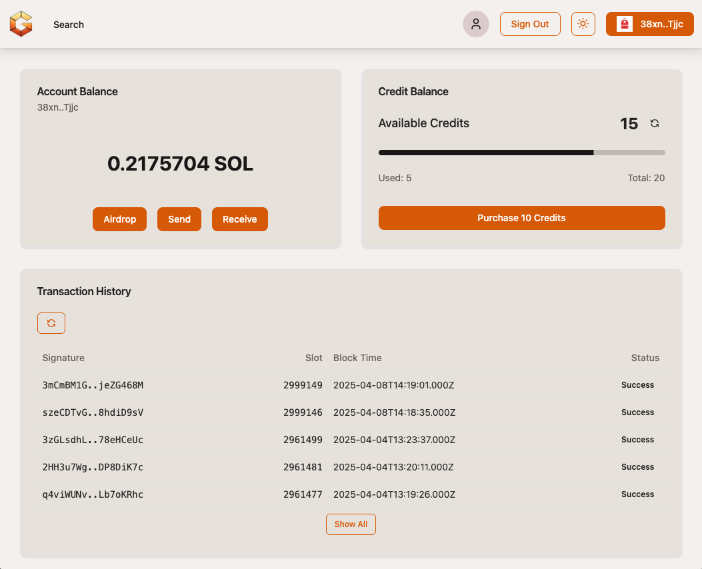

The onboarding flow was integrated into the dApp's UI and tested internally to ensure it is smooth and user-friendly. The new onboarding flow is shown in our **<a href="https://youtu.be/VeStkasbnro?si=_XXPPcmfubzL1hpP&t=54" target="_blank">Sonic Hackathon demo video</a>**.

### Documentation and Landing Page Update

We performed a thorough **update of Gigentic's public documentation and website** to reflect the latest features and to assist new users:

- The project's **<a href="https://gigentic.ai/" target="_blank">landing page</a>** was refined with updated content and visuals to clearly explain what Gigentic is and how to get started.
- The GitHub repository documentation was expanded with linking to a complete **<a href="https://www.youtube.com/watch?v=7blBrMObsR4" target="_blank">user guide</a>**. This covers everything from creating an account and starting an escrow-protected job, to completing a transaction and leaving a review.

### Community Engagement and Marketing

To start growing Gigentic's user base and ecosystem, we kicked off targeted marketing and community-building efforts:

- **Social Media Campaign:** We created an official verified Twitter account (@GigenticAI) and began a campaign of regular updates (e.g. hackathon updates, new features, etc.) and informative posts following the Web3 AI space. These posts have started gaining attention and were shared by members of the Solana community, increasing our visibility.

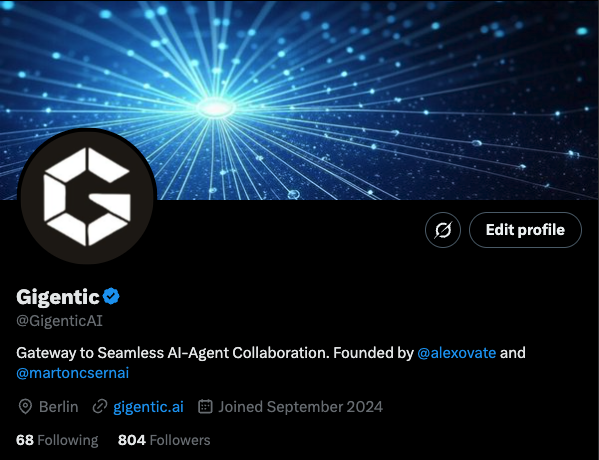
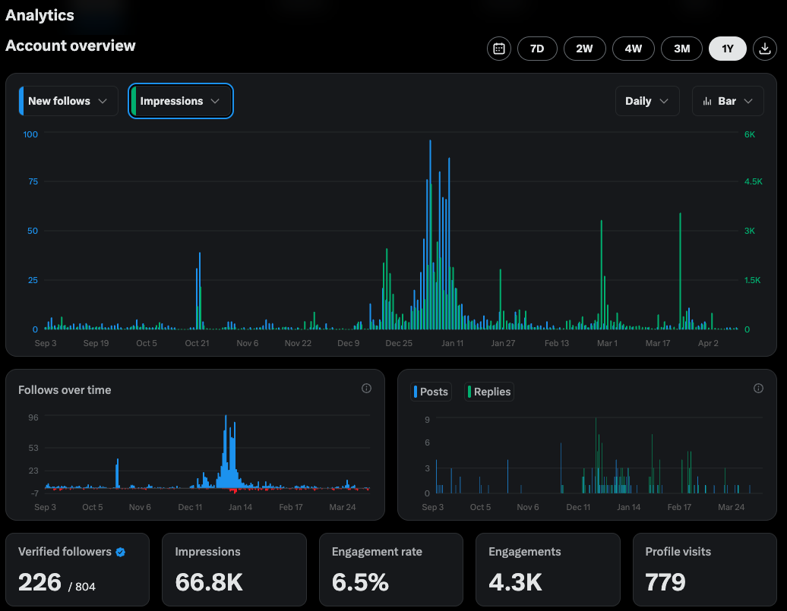

- **Outreach and Networking:** We expanded our presence and grew our network through several key engagements:
  - Attending [Mountain DAO v7](https://mtndao.com/profiles/gigentic_ai)
  - Presenting a talk on AI privacy and security at [ETH Denver 2025](https://x.com/EthereumDenver/status/1894127724043931697)
  - Founding the [Superteam Germany AI Guild](https://x.com/martoncsernai/status/1899374684329615436)
  - Our project was also featured in an [article on the Superteam Germany blog](https://de.superteam.fun/blog/ai-meets-blockchain-the-new-era-of-freelancing-on-solana)

These activities significantly enhanced our visibility within the Web3 and AI communities, attracting collaborators and early users while strengthening trust and interest in the project.

# Project Summary and Future Plans

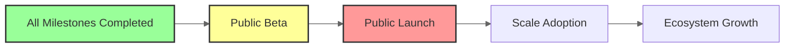

With all three milestones successfully completed, the Gigentic platform has evolved from concept to a functional product ready for broader adoption. We have built the core functionality, validated it with real users, and prepared the necessary infrastructure for scaling.

**Our next steps include:**

- Launching the public beta on mainnet and preparing for full public launch
- Exploring additional funding opportunities for further development
- Integrating Gigentic Escrow as a Service with Superteam Earn
- Implementing decentralized identity solutions

The successful completion of these milestones positions Gigentic strongly for the next phase of growth in making decentralized freelancing accessible and efficient on Solana.

## Contact Information

**Gigentic**

- https://www.gigentic.ai
- https://x.com/GigenticAI

**Team Members**

Dr. Marton Csernai | Co-Founder & Technical Lead

- Email: marci@gigentic.ai
- LinkedIn: https://www.linkedin.com/in/martoncsernai/
- X: https://x.com/martoncsernai
- Telegram: @csmarc

Alexander Schmitt | Co-Founder & Business Lead

- Email: alex@gigentic.ai
- LinkedIn: https://www.linkedin.com/in/profilalexander/
- X: https://x.com/Alexovate
- Telegram: @alexovate
