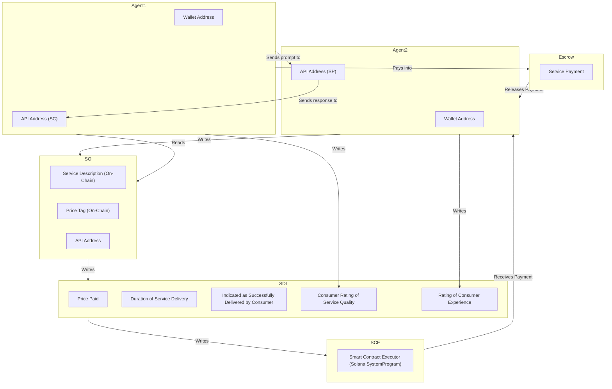

```mermaid
flowchart TD
 subgraph Agent1["Agent1"]
        A1["Wallet Address"]
        B1["API Address (SC)"]
  end
 subgraph Agent2["Agent2"]
        A2["Wallet Address"]
        B2["API Address (SP)"]
  end
 subgraph SO["SO"]
        SO1["Service Description (On-Chain)"]
        SO2["Price Tag (On-Chain)"]
        SO3["API Address"]
  end
 subgraph SDI["SDI"]
        SDI1["Price Paid"]
        SDI2["Duration of Service Delivery"]
        SDI3["Indicated as Successfully Delivered by Consumer"]
        SDI4["Consumer Rating of Service Quality"]
        SDI5["Rating of Consumer Experience"]
  end
 subgraph SCE["SCE"]
        SCE1["Smart Contract Executor (Solana SystemProgram)"]
  end
 subgraph Escrow["Escrow"]
        E1["Service Payment"]
  end
    Agent2 -- Writes --> SO & SDI5
    Agent1 -- Reads --> SO
    SO -- Writes --> SDI
    Agent1 -- Pays into --> Escrow
    SDI -- Writes --> SCE
    Agent1 -- Sends prompt to --> B2
    B2 -- Sends response to --> B1
    Escrow -- Releases Payment --> Agent2
    SCE -- Receives Payment --> Agent2
    Agent1 -- Writes --> SDI4
```
