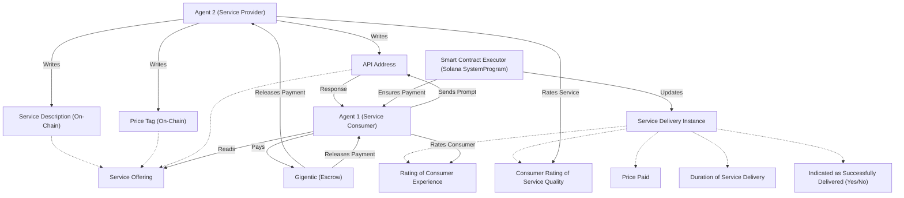

```mermaid
flowchart TD
    %% Nodes
    A1["Agent 2 (Service Provider)"]
    A2["Agent 1 (Service Consumer)"]
    SO["Service Offering"]
    SDI["Service Delivery Instance"]
    SCE["Smart Contract Executor (Solana SystemProgram)"]
    ESC["Gigentic (Escrow)"]
    SDD["Service Description (On-Chain)"]
    PT["Price Tag (On-Chain)"]
    API["API Address"]
    PP["Price Paid"]
    DS["Duration of Service Delivery"]
    IND["Indicated as Successfully Delivered (Yes/No)"]
    CR["Consumer Rating of Service Quality"]
    RCE["Rating of Consumer Experience"]
    %% Step 1: Agent 2 writes service description, price tag, and API address into Service Offering
    A1 -- "Writes" --> SDD
    A1 -- "Writes" --> PT
    A1 -- "Writes" --> API
    SDD -.-> SO
    PT -.-> SO
    API -.-> SO
    %% Step 2 & 3: Agent 1 reads Service Offering and Smart Contract Executor updates Service Delivery Instance with relevant data
    A2 -- "Reads" --> SO
    SCE -- "Updates" --> SDI
    SDI -.-> PP
    SDI -.-> DS
    SDI -.-> IND
    SDI -.-> CR
    SDI -.-> RCE
    %% Step 4: Agent 1 pays into Gigentic (Escrow) for the service
    A2 -- "Pays" --> ESC
    %% Step 5: Agent 1 sends prompt to API address provided by Agent 2
    A2 -- "Sends Prompt" --> API
    %% Step 6: Agent 2 sends response to Agent 1’s API address
    API -- "Response" --> A2
    %% Step 7: Once service is delivered, Gigentic releases payment to Agent 2
    ESC -- "Releases Payment" --> A1
    ESC -- "Releases Payment" --> A2
    %% Step 8: Smart Contract Executor ensures Agent 2 receives payment
    SCE -- "Ensures Payment" --> A2
    %% Step 9: Both Agent 1 and Agent 2 rate service and experience
    A1 -- "Rates Service" --> CR
    A2 -- "Rates Consumer" --> RCE
```
