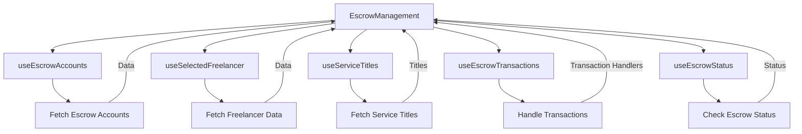

```mermaid
graph TD
    A[EscrowManagement] --> B[useEscrowAccounts]
    A --> C[useSelectedFreelancer]
    A --> D[useServiceTitles]
    A --> E[useEscrowTransactions]
    A --> F[useEscrowStatus]

    B --> G[Fetch Escrow Accounts]
    C --> H[Fetch Freelancer Data]
    D --> I[Fetch Service Titles]
    E --> J[Handle Transactions]
    F --> K[Check Escrow Status]

    G -->|Data| A
    H -->|Data| A
    I -->|Titles| A
    J -->|Transaction Handlers| A
    K -->|Status| A
```
