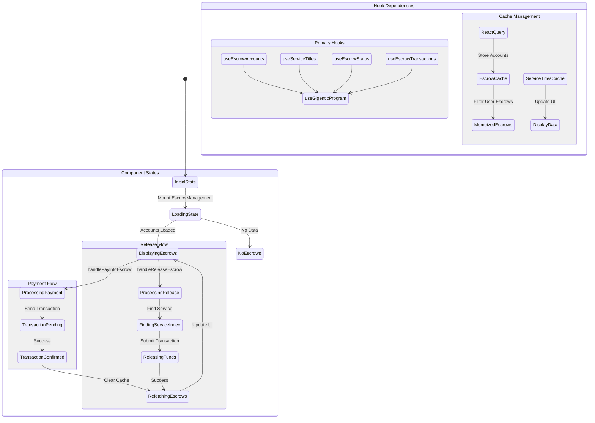

```mermaid
stateDiagram-v2
    [*] --> InitialState

    state "Component States" as ComponentStates {
        InitialState --> LoadingState: Mount EscrowManagement
        LoadingState --> DisplayingEscrows: Accounts Loaded
        LoadingState --> NoEscrows: No Data

        state "Payment Flow" as PaymentFlow {
            DisplayingEscrows --> ProcessingPayment: handlePayIntoEscrow
            ProcessingPayment --> TransactionPending: Send Transaction
            TransactionPending --> TransactionConfirmed: Success
            TransactionConfirmed --> RefetchingEscrows: Clear Cache
            RefetchingEscrows --> DisplayingEscrows: Update UI
        }

        state "Release Flow" as ReleaseFlow {
            DisplayingEscrows --> ProcessingRelease: handleReleaseEscrow
            ProcessingRelease --> FindingServiceIndex: Find Service
            FindingServiceIndex --> ReleasingFunds: Submit Transaction
            ReleasingFunds --> RefetchingEscrows: Success
        }
    }

    state "Hook Dependencies" as HookStates {
        state "Primary Hooks" as PrimaryHooks {
            useEscrowAccounts --> useGigenticProgram
            useServiceTitles --> useGigenticProgram
            useEscrowStatus --> useGigenticProgram
            useEscrowTransactions --> useGigenticProgram
        }

        state "Cache Management" as CacheStates {
            ReactQuery --> EscrowCache: Store Accounts
            EscrowCache --> MemoizedEscrows: Filter User Escrows
            ServiceTitlesCache --> DisplayData: Update UI
        }
    }
```
