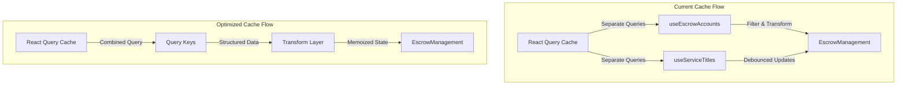

```mermaid
graph TD
    subgraph "Current Cache Flow"
        direction LR
        RQ1[React Query Cache]
        EA1[useEscrowAccounts]
        ST1[useServiceTitles]
        EM1[EscrowManagement]

        RQ1 -->|"Separate Queries"| EA1
        RQ1 -->|"Separate Queries"| ST1
        EA1 -->|"Filter & Transform"| EM1
        ST1 -->|"Debounced Updates"| EM1
    end

    subgraph "Optimized Cache Flow"
        direction LR
        RQ2[React Query Cache]
        QK[Query Keys]
        TC[Transform Layer]
        EM2[EscrowManagement]

        RQ2 -->|"Combined Query"| QK
        QK -->|"Structured Data"| TC
        TC -->|"Memoized State"| EM2
    end
```
