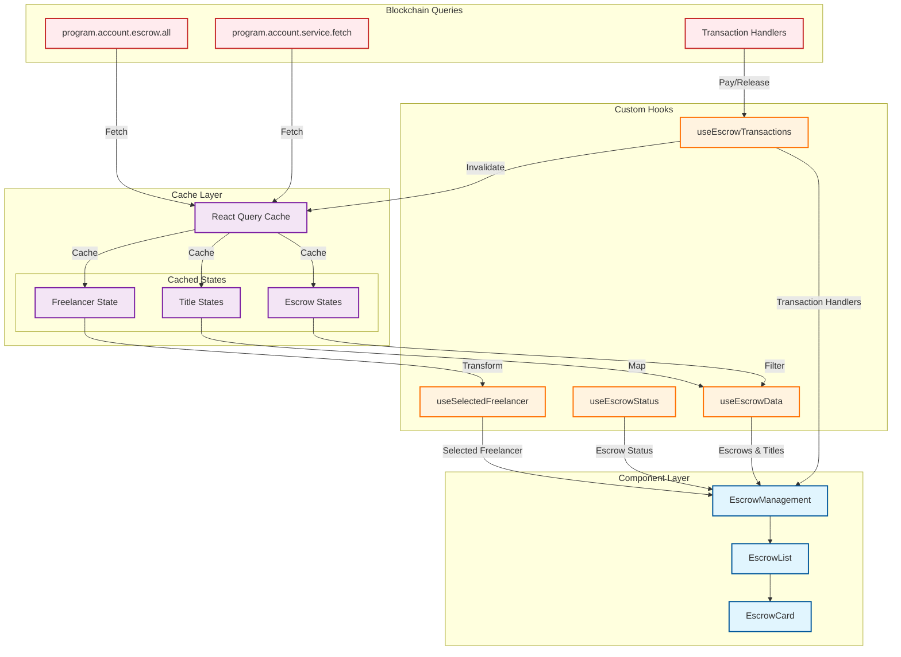

```mermaid
graph TD
    subgraph "Component Layer"
        EM[EscrowManagement]
        EL[EscrowList]
        EC[EscrowCard]
    end

    subgraph "Custom Hooks"
        UED[useEscrowData]
        UET[useEscrowTransactions]
        UES[useEscrowStatus]
        USF[useSelectedFreelancer]
    end

    subgraph "Cache Layer"
        RQC[React Query Cache]
        subgraph "Cached States"
            ES[Escrow States]
            TS[Title States]
            FS[Freelancer State]
        end
    end

    subgraph "Blockchain Queries"
        EA[program.account.escrow.all]
        SF[program.account.service.fetch]
        TH[Transaction Handlers]
    end

    %% Component Dependencies
    EM --> EL
    EL --> EC

    %% Hook Flow
    UED -->|Escrows & Titles| EM
    UET -->|Transaction Handlers| EM
    UES -->|Escrow Status| EM
    USF -->|Selected Freelancer| EM

    %% Cache Management
    EA -->|Fetch| RQC
    SF -->|Fetch| RQC
    RQC -->|Cache| ES
    RQC -->|Cache| TS
    RQC -->|Cache| FS

    %% Data Flow
    ES -->|Filter| UED
    TS -->|Map| UED
    FS -->|Transform| USF

    %% Transaction Flow
    TH -->|Pay/Release| UET
    UET -->|Invalidate| RQC

    classDef component fill:#e1f5fe,stroke:#01579b,stroke-width:2px;
    classDef hook fill:#fff3e0,stroke:#ff6f00,stroke-width:2px;
    classDef cache fill:#f3e5f5,stroke:#7b1fa2,stroke-width:2px;
    classDef query fill:#ffebee,stroke:#c62828,stroke-width:2px;

    class EM,EL,EC component;
    class UED,UET,UES,USF hook;
    class RQC,ES,TS,FS cache;
    class EA,SF,TH query;
```
