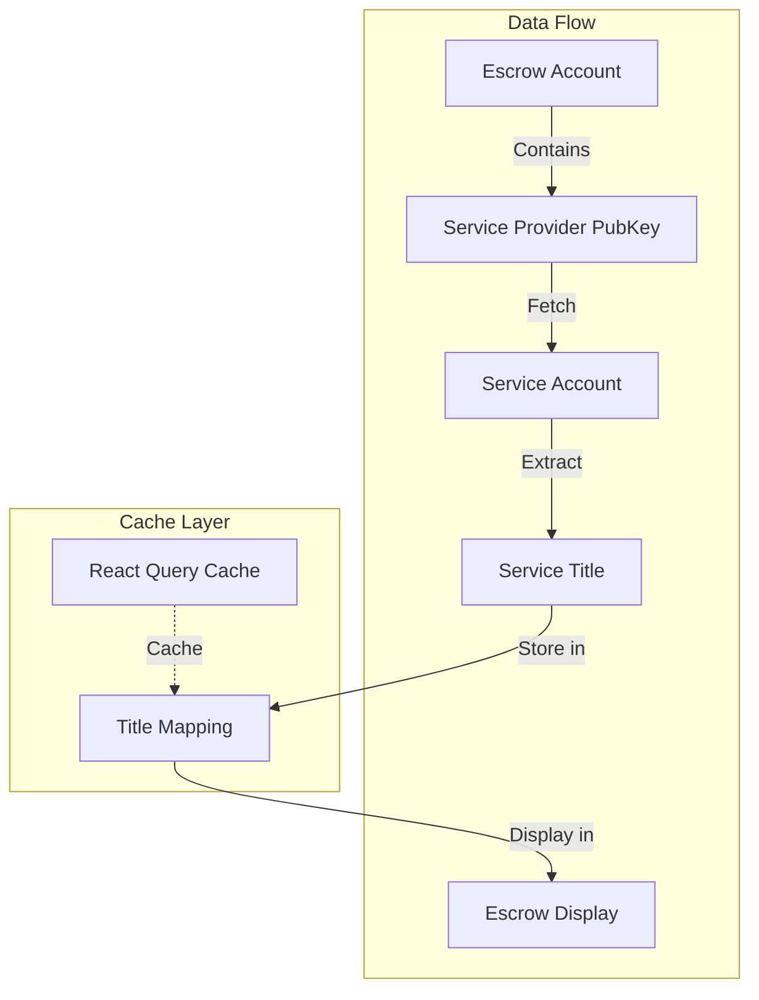

```mermaid
graph TD
    subgraph "Data Flow"
        EA[Escrow Account]
        SP[Service Provider PubKey]
        SA[Service Account]
        ST[Service Title]
        ED[Escrow Display]
    end

    subgraph "Cache Layer"
        RQC[React Query Cache]
        TM[Title Mapping]
    end

    EA -->|Contains| SP
    SP -->|Fetch| SA
    SA -->|Extract| ST
    ST -->|Store in| TM
    TM -->|Display in| ED

    RQC -.->|Cache| TM
```
