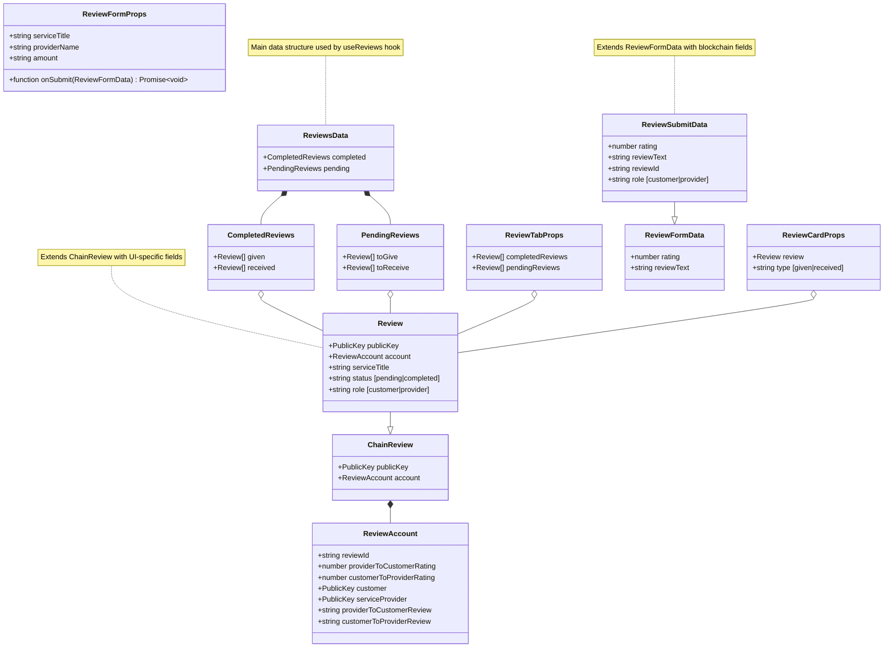

```mermaid
classDiagram
    class ChainReview {
        +PublicKey publicKey
        +ReviewAccount account
    }

    class ReviewAccount {
        +string reviewId
        +number providerToCustomerRating
        +number customerToProviderRating
        +PublicKey customer
        +PublicKey serviceProvider
        +string providerToCustomerReview
        +string customerToProviderReview
    }

    class Review {
        +PublicKey publicKey
        +ReviewAccount account
        +string serviceTitle
        +string status [pending|completed]
        +string role [customer|provider]
    }

    class ReviewsData {
        +CompletedReviews completed
        +PendingReviews pending
    }

    class CompletedReviews {
        +Review[] given
        +Review[] received
    }

    class PendingReviews {
        +Review[] toGive
        +Review[] toReceive
    }

    class ReviewTabProps {
        +Review[] completedReviews
        +Review[] pendingReviews
    }

    class ReviewCardProps {
        +Review review
        +string type [given|received]
    }

    class ReviewFormData {
        +number rating
        +string reviewText
    }

    class ReviewFormProps {
        +string serviceTitle
        +string providerName
        +string amount
        +function onSubmit(ReviewFormData) Promise~void~
    }

    class ReviewSubmitData {
        +number rating
        +string reviewText
        +string reviewId
        +string role [customer|provider]
    }

    ChainReview *-- ReviewAccount
    Review --|> ChainReview
    ReviewsData *-- CompletedReviews
    ReviewsData *-- PendingReviews
    CompletedReviews o-- Review
    PendingReviews o-- Review
    ReviewTabProps o-- Review
    ReviewCardProps o-- Review
    ReviewSubmitData --|> ReviewFormData

    note for Review "Extends ChainReview with UI-specific fields"
    note for ReviewSubmitData "Extends ReviewFormData with blockchain fields"
    note for ReviewsData "Main data structure used by useReviews hook"
```
