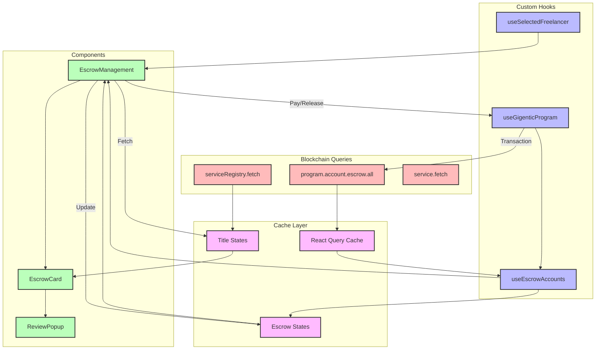

```mermaid
graph TD
    subgraph "Components"
        EM[EscrowManagement]
        EC[EscrowCard]
        RP[ReviewPopup]
    end

    subgraph "Custom Hooks"
        EA[useEscrowAccounts]
        SF[useSelectedFreelancer]
        GP[useGigenticProgram]
    end

    subgraph "Cache Layer"
        RQ[React Query Cache]
        TS[Title States]
        ES[Escrow States]
    end

    subgraph "Blockchain Queries"
        EF[program.account.escrow.all]
        SR[serviceRegistry.fetch]
        SF2[service.fetch]
    end

    %% Hook Dependencies
    GP --> EA
    EA --> EM
    SF --> EM

    %% Cache Flow
    EF --> RQ
    RQ --> EA
    EA --> ES
    SR --> TS

    %% Component Relationships
    EM --> EC
    EC --> RP
    ES --> EM
    TS --> EC

    %% State Management
    EM -->|Update| ES
    EM -->|Fetch| TS

    %% Transaction Flow
    EM -->|Pay/Release| GP
    GP -->|Transaction| EF

    classDef components fill:#bfb,stroke:#333,stroke-width:2px;
    classDef hooks fill:#bbf,stroke:#333,stroke-width:2px;
    classDef cache fill:#fbf,stroke:#333,stroke-width:2px;
    classDef blockchain fill:#fbb,stroke:#333,stroke-width:2px;

    class EM,EC,RP components;
    class EA,SF,GP hooks;
    class RQ,TS,ES cache;
    class EF,SR,SF2 blockchain;
```
