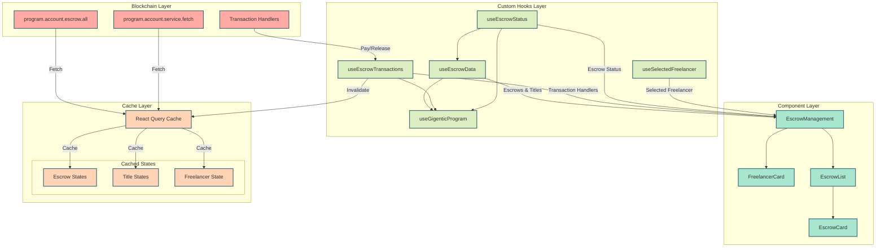

```mermaid
graph TD
    subgraph "Component Layer"
        EM[EscrowManagement]
        FL[FreelancerCard]
        EL[EscrowList]
        EC[EscrowCard]
    end

    subgraph "Custom Hooks Layer"
        ED[useEscrowData]
        ET[useEscrowTransactions]
        ES[useEscrowStatus]
        SF[useSelectedFreelancer]
        GP[useGigenticProgram]
    end

    subgraph "Cache Layer"
        RQ[React Query Cache]
        subgraph "Cached States"
            ESC[Escrow States]
            TS[Title States]
            FS[Freelancer State]
        end
    end

    subgraph "Blockchain Layer"
        EA[program.account.escrow.all]
        SA[program.account.service.fetch]
        TH[Transaction Handlers]
    end

    %% Component Dependencies
    EM --> FL
    EM --> EL
    EL --> EC

    %% Hook Dependencies
    ED --> GP
    ET --> GP
    ES --> GP
    ES --> ED

    %% Data Flow
    EA -->|Fetch| RQ
    SA -->|Fetch| RQ
    RQ -->|Cache| ESC
    RQ -->|Cache| TS
    RQ -->|Cache| FS

    %% Hook to Component Flow
    ED -->|Escrows & Titles| EM
    ET -->|Transaction Handlers| EM
    ES -->|Escrow Status| EM
    SF -->|Selected Freelancer| EM

    %% Transaction Flow
    TH -->|Pay/Release| ET
    ET -->|Invalidate| RQ

    classDef component fill:#a8e6cf,stroke:#3b6978,stroke-width:2px;
    classDef hook fill:#dcedc1,stroke:#3b6978,stroke-width:2px;
    classDef cache fill:#ffd3b6,stroke:#3b6978,stroke-width:2px;
    classDef blockchain fill:#ffaaa5,stroke:#3b6978,stroke-width:2px;

    class EM,FL,EL,EC component;
    class ED,ET,ES,SF,GP hook;
    class RQ,ESC,TS,FS cache;
    class EA,SA,TH blockchain;
```
