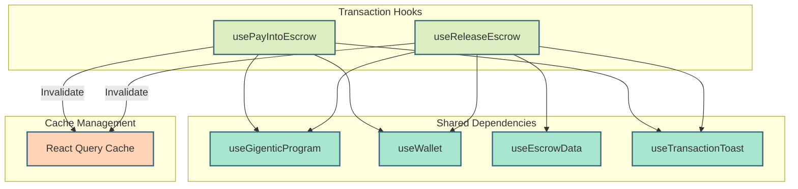

```mermaid
graph TD
    subgraph "Transaction Hooks"
        UPE[usePayIntoEscrow]
        URE[useReleaseEscrow]
    end

    subgraph "Shared Dependencies"
        GP[useGigenticProgram]
        WA[useWallet]
        ED[useEscrowData]
        TT[useTransactionToast]
    end

    subgraph "Cache Management"
        RQ[React Query Cache]
    end

    %% Hook Dependencies

    UPE --> GP
    UPE --> WA
    UPE --> TT
    URE --> GP
    URE --> WA
    URE --> ED
    URE --> TT

    %% Cache Interactions
    UPE -->|Invalidate| RQ
    URE -->|Invalidate| RQ

    classDef hooks fill:#dcedc1,stroke:#3b6978,stroke-width:2px;
    classDef deps fill:#a8e6cf,stroke:#3b6978,stroke-width:2px;
    classDef cache fill:#ffd3b6,stroke:#3b6978,stroke-width:2px;

    class UPE,URE hooks;
    class GP,WA,ED,TT deps;
    class RQ cache;
```
