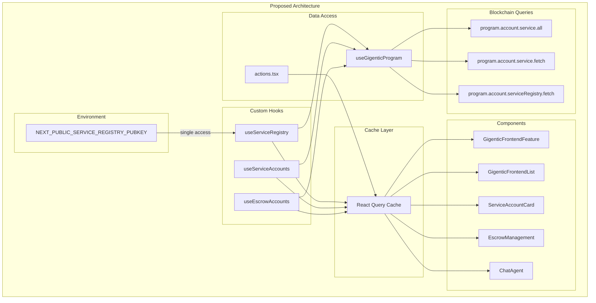

```mermaid
graph TD
    subgraph "Proposed Architecture"
        subgraph "Components"
            A2[GigenticFrontendFeature]
            B2[GigenticFrontendList]
            C2[ServiceAccountCard]
            D2[EscrowManagement]
            E2[ChatAgent]
        end

        subgraph "Custom Hooks"
            F2[useServiceRegistry]
            G2[useServiceAccounts]
            H2[useEscrowAccounts]
        end

        subgraph "Cache Layer"
            I2[React Query Cache]
        end

        subgraph "Data Access"
            J2[useGigenticProgram]
            K2[actions.tsx]
        end

        subgraph "Environment"
            L2[NEXT_PUBLIC_SERVICE_REGISTRY_PUBKEY]
        end

        subgraph "Blockchain Queries"
            M2[program.account.service.all]
            N2[program.account.service.fetch]
            O2[program.account.serviceRegistry.fetch]
        end

        %% Env var access
        L2 -->|"single access"| F2

        %% Hook to Cache
        F2 --> I2
        G2 --> I2
        H2 --> I2

        %% Cache to Components
        I2 --> A2
        I2 --> B2
        I2 --> C2
        I2 --> D2
        I2 --> E2

        %% Data Access relationships
        F2 --> J2
        G2 --> J2
        H2 --> J2
        K2 --> I2

        %% Data Access to Blockchain
        J2 --> M2
        J2 --> N2
        J2 --> O2
    end
```
