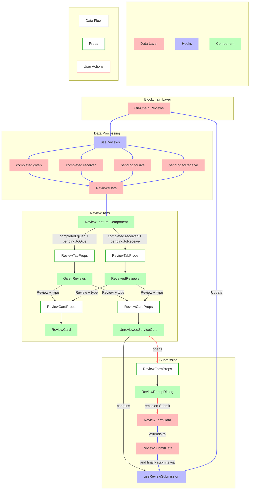

```mermaid
flowchart TD
    %% Data Layer
    subgraph "Blockchain Layer"
      CR[program.account.review.all]:::dataLayer
    end

    subgraph "Data Processing"
      TR[useReviews]:::hook
      RD[ReviewsData]:::dataLayer
      RDG[completed.given]:::dataLayer
      RDR[completed.received]:::dataLayer
      PDG[pending.toGive]:::dataLayer
      PDR[pending.toReceive]:::dataLayer
    end

      CR --> TR
      TR --> RDG
      TR --> RDR
      TR --> PDG
      TR --> PDR

      RDG --> RD
      RDR --> RD
      PDG --> RD
      PDR --> RD

    linkStyle 0,1,2,3,4,5,6,7,8 stroke:#66f,stroke-width:2px

    %% Main Component
    subgraph "Review Tabs"
      RD --> RF
      linkStyle 9 stroke:#66f,stroke-width:2px
      RF[ReviewFeature Component]:::component

      RF -->|"completed.given + pending.toGive"| RTP1
      RF -->|"completed.received + pending.toReceive"| RTP2
      RTP1[ReviewTabProps]:::prop
      RTP2[ReviewTabProps]:::prop
      RTP1 --> GR
      RTP2 --> RR
      GR[GivenReviews]:::component
      RR[ReceivedReviews]:::component
      GR -->|"Review + type"| RCP
      RR -->|"Review + type"| RCP
      RCP[ReviewCardProps]:::prop
      RCP --> RC
      RC[ReviewCard]:::component
      GR -->|"Review + type"| USCP
      RR -->|"Review + type"| USCP
      USCP[ReviewCardProps]:::prop
      USC[UnreviewedServiceCard]:::component
      USCP --> USC
    end

    %% Main Component
    subgraph "Submission"
      USC -->|"contains"| URS
      USC -->|"opens"| RFP
      RFP[ReviewFormProps]:::prop
      RFP --> RPD
      RPD[ReviewPopupDialog]:::component
      RPD -->|"emits on Submit"| RFD
      RFD[ReviewFormData]:::dataLayer
      RFD -->|"extends to"| RSD
      RSD[ReviewSubmitData]:::dataLayer
      RSD -->|"and finally submits via"| URS
      URS[useReviewSubmission]:::hook
      URS -->|"Update"| CR
      CR[On-Chain Reviews]:::dataLayer
    end

    %% Style different types of arrows
    linkStyle 21,23 stroke:#f66,stroke-width:2px
    linkStyle 24,25,26 stroke:#66f,stroke-width:2px

    %% Class Definitions
    classDef dataLayer fill:#fbb,stroke-width:0px
    classDef hook fill:#bbf,stroke-width:0px
    classDef dataFlow fill:#fff,stroke:#66f,stroke-width:2px
    classDef component fill:#bfb,stroke-width:0px
    classDef prop fill:#fff,stroke:#2a2,stroke-width:2px
    classDef action fill:#fff,stroke:#f66,stroke-width:2px

    L1 ~~~ CR
    %% Legend Top
    subgraph " "
        L1[Data Layer]:::dataLayer
        L2[Hooks]:::hook
        L3[Component]:::component
    end

    %% Legend Bottom
    subgraph " "
        L4["Data Flow"]:::dataFlow
        L5["Props"]:::prop
        L6["User Actions"]:::action
    end
```
