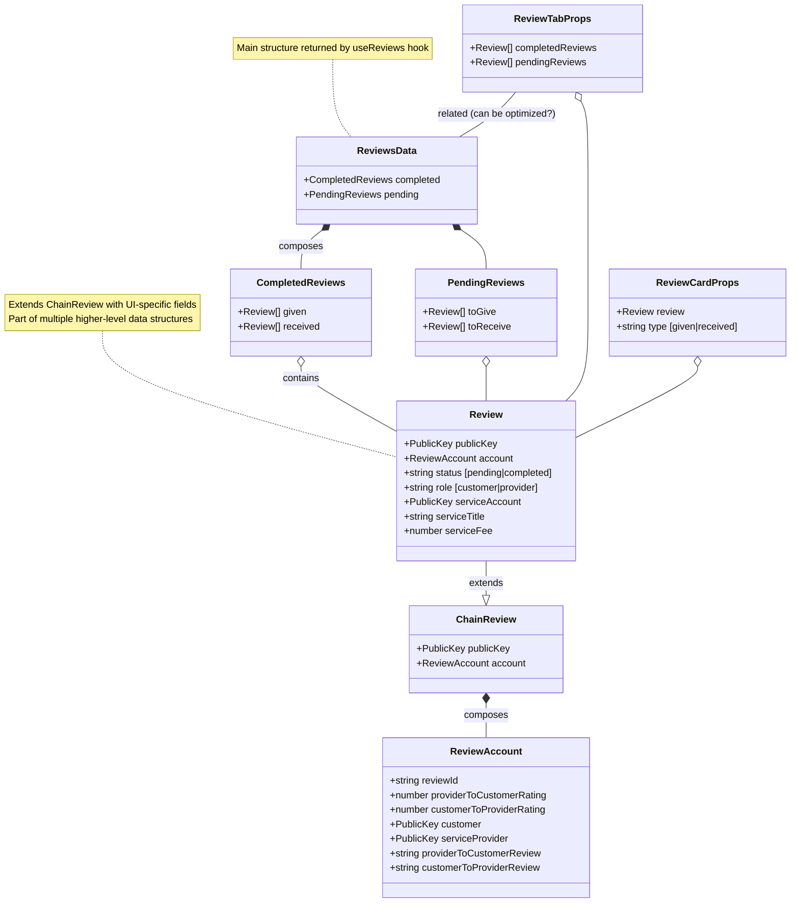

```mermaid
classDiagram
    class ChainReview {
        +PublicKey publicKey
        +ReviewAccount account
    }

    class ReviewAccount {
        +string reviewId
        +number providerToCustomerRating
        +number customerToProviderRating
        +PublicKey customer
        +PublicKey serviceProvider
        +string providerToCustomerReview
        +string customerToProviderReview
    }

    class Review {
        +PublicKey publicKey
        +ReviewAccount account
        +string status [pending|completed]
        +string role [customer|provider]
        +PublicKey serviceAccount
        +string serviceTitle
        +number serviceFee
    }

    class ReviewsData {
        +CompletedReviews completed
        +PendingReviews pending
    }

    class ReviewTabProps {
        +Review[] completedReviews
        +Review[] pendingReviews
    }

    class CompletedReviews {
        +Review[] given
        +Review[] received
    }

    class PendingReviews {
        +Review[] toGive
        +Review[] toReceive
    }

    class ReviewCardProps {
        +Review review
        +string type [given|received]
    }


    ChainReview *-- ReviewAccount : composes
    Review --|> ChainReview : extends
    ReviewsData *-- CompletedReviews : composes
    ReviewsData *-- PendingReviews
    CompletedReviews o-- Review : contains
    PendingReviews o-- Review
    ReviewTabProps o-- Review
    ReviewTabProps -- ReviewsData : related (can be optimized?)
    ReviewCardProps o-- Review

    note for Review "Extends ChainReview with UI-specific fields </br> Part of multiple higher-level data structures"
    note for ReviewsData "Main structure returned by useReviews hook"
```
