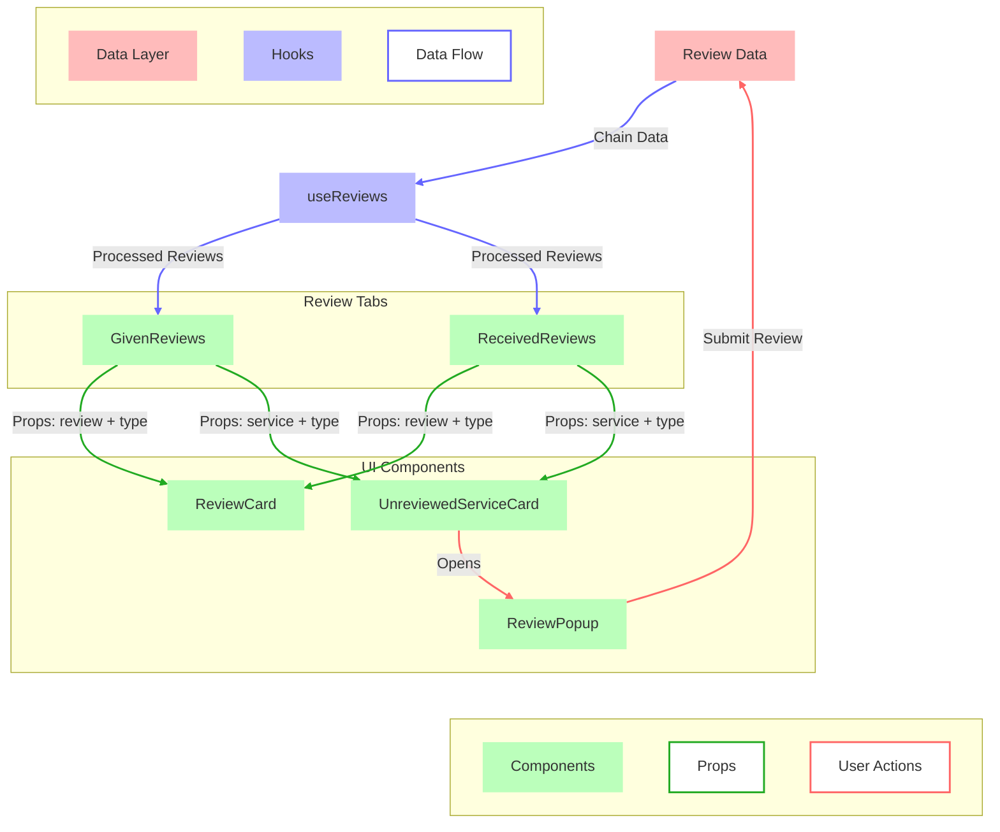

```mermaid
flowchart TD

    D[Review Data]:::dataLayer

    UR[useReviews]:::hook

    subgraph "Review Tabs"
        GR[GivenReviews]:::component
        RR[ReceivedReviews]:::component
    end

    subgraph "UI Components"
        RC[ReviewCard]:::component
        USC[UnreviewedServiceCard]:::component
        RP[ReviewPopup]:::component
    end

    %% Data Flow
    D -->|"Chain Data"| UR
    UR -->|"Processed Reviews"| GR
    UR -->|"Processed Reviews"| RR

    %% Props Flow
    GR -->|"Props: review + type"| RC
    RR -->|"Props: review + type"| RC
    GR -->|"Props: service + type"| USC
    RR -->|"Props: service + type"| USC

    %% User Actions
    USC -->|"Opens"| RP
    RP -->|"Submit Review"| D

    %% Invisible arrow to position legend
    L1 ~~~ UR
    RP ~~~ L3

    %% Legend Top
    subgraph " "
        L1[Data Layer]:::dataLayer
        L2[Hooks]:::hook
        L4["Data Flow"]:::dataFlow
    end

    %% Legend Bottom
    subgraph " "
        L3[Components]:::component
        L5["Props"]:::prop
        L6["User Actions"]:::action
    end

    %% Style different types of arrows
    linkStyle 0,1,2 stroke:#66f,stroke-width:2px
    linkStyle 3,4,5,6 stroke:#2a2,stroke-width:2px
    linkStyle 7,8 stroke:#f66,stroke-width:2px

    %% Class Definitions
    classDef dataLayer fill:#fbb,stroke-width:0px
    classDef hook fill:#bbf,stroke-width:0px
    classDef dataFlow fill:#fff,stroke:#66f,stroke-width:2px
    classDef component fill:#bfb,stroke-width:0px
    classDef prop fill:#fff,stroke:#2a2,stroke-width:2px
    classDef action fill:#fff,stroke:#f66,stroke-width:2px
```
