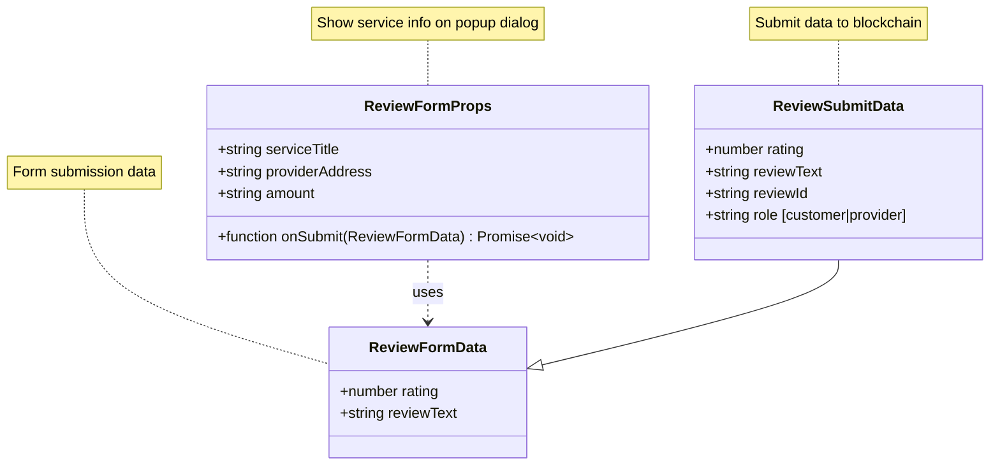

```mermaid
classDiagram

    class ReviewFormData {
        +number rating
        +string reviewText
    }

    class ReviewFormProps {
        +string serviceTitle
        +string providerAddress
        +string amount
        +function onSubmit(ReviewFormData) Promise~void~
    }

    class ReviewSubmitData {
        +number rating
        +string reviewText
        +string reviewId
        +string role [customer|provider]
    }

    ReviewFormProps ..> ReviewFormData : uses
    ReviewSubmitData --|> ReviewFormData

    note for ReviewFormData "Form submission data"
    note for ReviewSubmitData "Submit data to blockchain"
    note for ReviewFormProps "Show service info on popup dialog"
```
