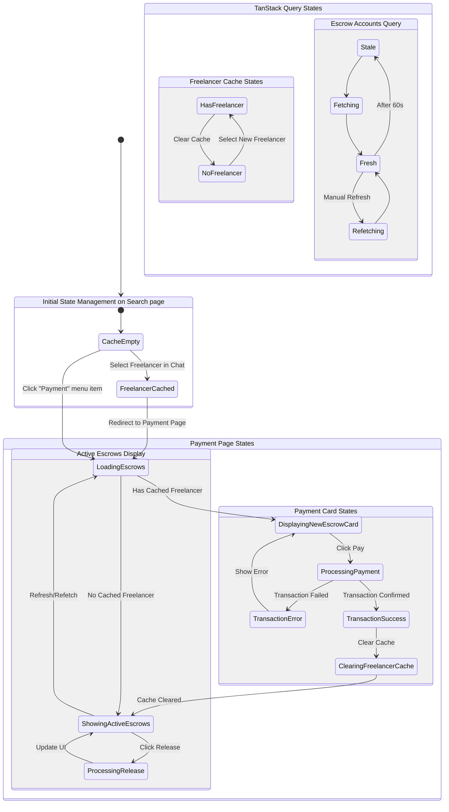

```mermaid
stateDiagram-v2
    [*] --> InitialState

    state "Initial State Management on Search page" as InitialState {
        [*] --> CacheEmpty
        CacheEmpty --> FreelancerCached : Select Freelancer in Chat
        CacheEmpty --> LoadingEscrows : Click "Payment" menu item
        FreelancerCached --> LoadingEscrows : Redirect to Payment Page
    }

    state "Payment Page States" as PaymentPage {
        LoadingEscrows --> DisplayingNewEscrowCard : Has Cached Freelancer
        LoadingEscrows --> ShowingActiveEscrows : No Cached Freelancer

        state "Payment Card States" as PaymentCard {
            DisplayingNewEscrowCard --> ProcessingPayment : Click Pay
            ProcessingPayment --> TransactionSuccess : Transaction Confirmed
            ProcessingPayment --> TransactionError : Transaction Failed
            TransactionSuccess --> ClearingFreelancerCache : Clear Cache
            ClearingFreelancerCache --> ShowingActiveEscrows : Cache Cleared
            TransactionError --> DisplayingNewEscrowCard : Show Error
        }

        state "Active Escrows Display" as ActiveEscrows {
            ShowingActiveEscrows --> LoadingEscrows : Refresh/Refetch
            ShowingActiveEscrows --> ProcessingRelease : Click Release
            ProcessingRelease --> ShowingActiveEscrows : Update UI
        }
    }

    state "TanStack Query States" as QueryStates {
        state "Freelancer Cache States" as FreelancerCache {
            HasFreelancer --> NoFreelancer : Clear Cache
            NoFreelancer --> HasFreelancer : Select New Freelancer
        }

        state "Escrow Accounts Query" as EscrowQuery {
            Stale --> Fetching
            Fetching --> Fresh
            Fresh --> Stale : After 60s
            Fresh --> Refetching : Manual Refresh
            Refetching --> Fresh
        }
    }
```
