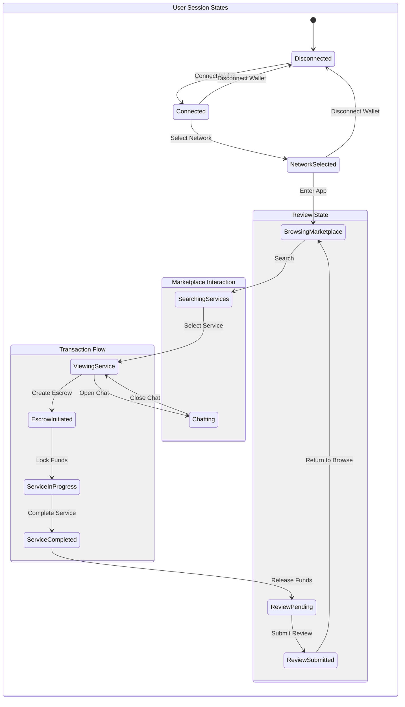

```mermaid
stateDiagram-v2


    state "User Session States" as UserSession {
        [*] --> Disconnected
        Disconnected --> Connected : Connect Wallet
        Connected --> NetworkSelected : Select Network
        NetworkSelected --> BrowsingMarketplace : Enter App

        state "Marketplace Interaction" as MarketplaceState {
            BrowsingMarketplace --> SearchingServices : Search
            SearchingServices --> ViewingService : Select Service
            ViewingService --> Chatting : Open Chat
            Chatting --> ViewingService : Close Chat
        }

        state "Transaction Flow" as TransactionState {
            ViewingService --> EscrowInitiated : Create Escrow
            EscrowInitiated --> ServiceInProgress : Lock Funds
            ServiceInProgress --> ServiceCompleted : Complete Service
            ServiceCompleted --> ReviewPending : Release Funds
        }

        state "Review State" as ReviewState {
            ReviewPending --> ReviewSubmitted : Submit Review
            ReviewSubmitted --> BrowsingMarketplace : Return to Browse
        }
    }


    %% Global state transitions
    Connected --> Disconnected : Disconnect Wallet
    NetworkSelected --> Disconnected : Disconnect Wallet
```
