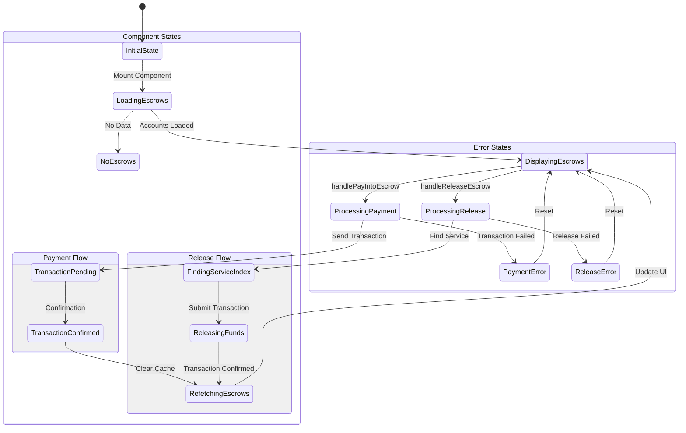

```mermaid
stateDiagram-v2
    [*] --> InitialState

    state "Component States" as ComponentStates {
        InitialState --> LoadingEscrows: Mount Component
        LoadingEscrows --> DisplayingEscrows: Accounts Loaded
        LoadingEscrows --> NoEscrows: No Data

        state "Payment Flow" as PaymentFlow {
            DisplayingEscrows --> ProcessingPayment: handlePayIntoEscrow
            ProcessingPayment --> TransactionPending: Send Transaction
            TransactionPending --> TransactionConfirmed: Confirmation
            TransactionConfirmed --> RefetchingEscrows: Clear Cache
            RefetchingEscrows --> DisplayingEscrows: Update UI
        }

        state "Release Flow" as ReleaseFlow {
            DisplayingEscrows --> ProcessingRelease: handleReleaseEscrow
            ProcessingRelease --> FindingServiceIndex: Find Service
            FindingServiceIndex --> ReleasingFunds: Submit Transaction
            ReleasingFunds --> RefetchingEscrows: Transaction Confirmed
        }
    }

    state "Error States" as ErrorStates {
        ProcessingPayment --> PaymentError: Transaction Failed
        ProcessingRelease --> ReleaseError: Release Failed
        PaymentError --> DisplayingEscrows: Reset
        ReleaseError --> DisplayingEscrows: Reset
    }
```
