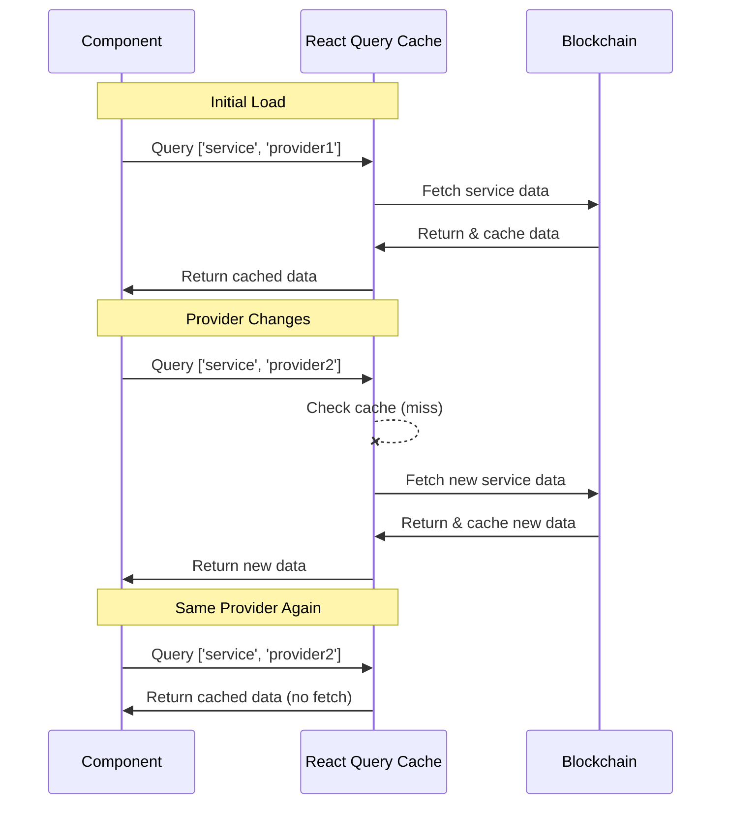

```mermaid
sequenceDiagram
    participant C as Component
    participant RQ as React Query Cache
    participant BC as Blockchain

    Note over C,RQ: Initial Load
    C->>RQ: Query ['service', 'provider1']
    RQ->>BC: Fetch service data
    BC->>RQ: Return & cache data
    RQ->>C: Return cached data

    Note over C,RQ: Provider Changes
    C->>RQ: Query ['service', 'provider2']
    RQ--xRQ: Check cache (miss)
    RQ->>BC: Fetch new service data
    BC->>RQ: Return & cache new data
    RQ->>C: Return new data

    Note over C,RQ: Same Provider Again
    C->>RQ: Query ['service', 'provider2']
    RQ->>C: Return cached data (no fetch)
```
