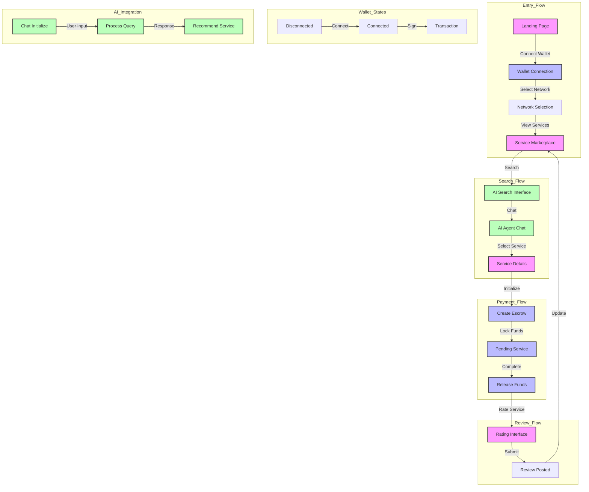

```mermaid
graph TD
subgraph Entry_Flow
A[Landing Page] -->|Connect Wallet| B[Wallet Connection]
B -->|Select Network| C[Network Selection]
C -->|View Services| D[Service Marketplace]
end

    subgraph Search_Flow
        D -->|Search| E[AI Search Interface]
        E -->|Chat| F[AI Agent Chat]
        F -->|Select Service| G[Service Details]
    end

    subgraph Payment_Flow
        G -->|Initialize| H[Create Escrow]
        H -->|Lock Funds| I[Pending Service]
        I -->|Complete| J[Release Funds]
    end

    subgraph Review_Flow
        J -->|Rate Service| K[Rating Interface]
        K -->|Submit| L[Review Posted]
        L -->|Update| D
    end

    %% Wallet States
    subgraph Wallet_States
        W1[Disconnected]
        W2[Connected]
        W3[Transaction]
        W1 -->|Connect| W2
        W2 -->|Sign| W3
    end

    %% AI Integration
    subgraph AI_Integration
        AI1[Chat Initialize]
        AI2[Process Query]
        AI3[Recommend Service]
        AI1 -->|User Input| AI2
        AI2 -->|Response| AI3
    end

    %% Add styles
    classDef userFlow fill:#f9f,stroke:#333,stroke-width:2px;
    classDef walletFlow fill:#bbf,stroke:#333,stroke-width:2px;
    classDef aiFlow fill:#bfb,stroke:#333,stroke-width:2px;

    class A,D,G,K userFlow;
    class B,H,I,J walletFlow;
    class E,F,AI1,AI2,AI3 aiFlow;
```
