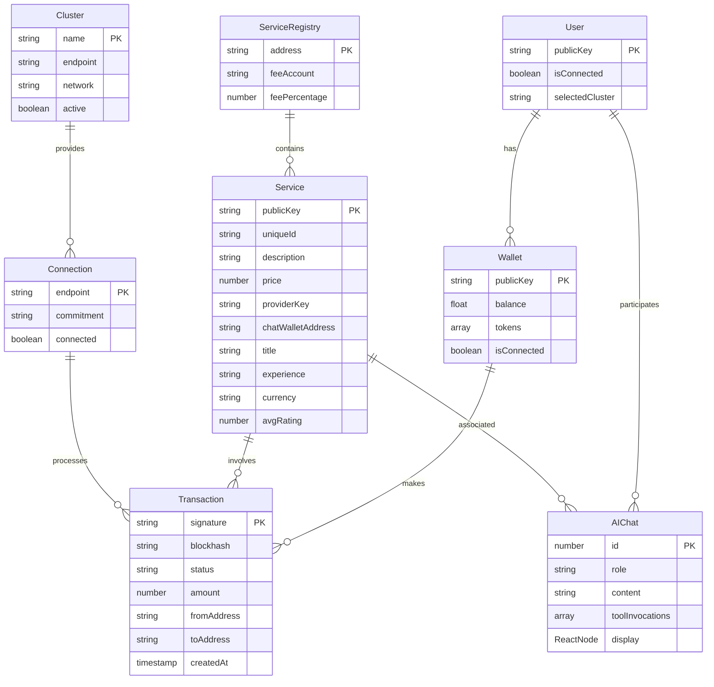

```mermaid
erDiagram
User ||--o{ Wallet : "has"
User ||--o{ AIChat : "participates"
Wallet ||--o{ Transaction : "makes"
ServiceRegistry ||--o{ Service : "contains"
Service ||--o{ AIChat : "associated"
Service ||--o{ Transaction : "involves"
Cluster ||--o{ Connection : "provides"
Connection ||--o{ Transaction : "processes"

    User {
        string publicKey PK
        boolean isConnected
        string selectedCluster
    }

    Wallet {
        string publicKey PK
        float balance
        array tokens
        boolean isConnected
    }

    Transaction {
        string signature PK
        string blockhash
        string status
        number amount
        string fromAddress
        string toAddress
        timestamp createdAt
    }

    ServiceRegistry {
        string address PK
        string feeAccount
        number feePercentage
    }

    Service {
        string publicKey PK
        string uniqueId
        string description
        number price
        string providerKey
        string chatWalletAddress
        string title
        string experience
        string currency
        number avgRating
    }

    AIChat {
        number id PK
        string role
        string content
        array toolInvocations
        ReactNode display
    }

    Cluster {
        string name PK
        string endpoint
        string network
        boolean active
    }

    Connection {
        string endpoint PK
        string commitment
        boolean connected
    }
```
