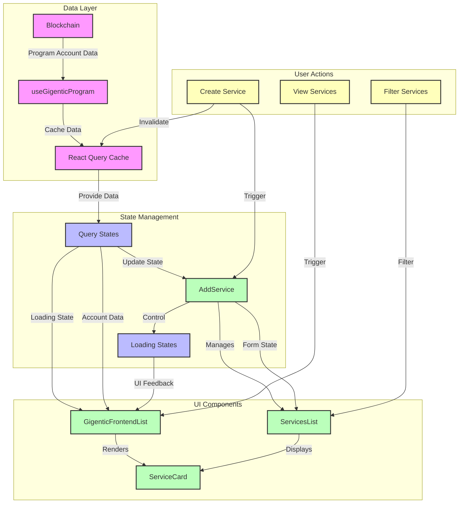

```mermaid
graph TD
    subgraph "Data Layer"
        UP[useGigenticProgram]
        RQ[React Query Cache]
        BC[Blockchain]
    end

    subgraph "State Management"
        QS[Query States]
        AS[Account States]
        LS[Loading States]
    end

    subgraph "UI Components"
        GFL[GigenticFrontendList]
        SC[ServiceCard]
        AS[AddService]
        SL[ServicesList]
    end

    subgraph "User Actions"
        UA1[View Services]
        UA2[Create Service]
        UA3[Filter Services]
    end

    %% Data Flow Relationships
    BC -->|Program Account Data| UP
    UP -->|Cache Data| RQ
    RQ -->|Provide Data| QS
    QS -->|Update State| AS
    AS -->|Control| LS

    %% Component Relationships
    GFL -->|Renders| SC
    AS -->|Manages| SL
    SL -->|Displays| SC

    %% State to UI Flow
    QS -->|Loading State| GFL
    QS -->|Account Data| GFL
    AS -->|Form State| SL
    LS -->|UI Feedback| GFL

    %% User Action Flow
    UA1 -->|Trigger| GFL
    UA2 -->|Trigger| AS
    UA3 -->|Filter| SL

    %% Cache Invalidation
    UA2 -->|Invalidate| RQ

    classDef dataLayer fill:#f9f,stroke:#333,stroke-width:2px;
    classDef stateLayer fill:#bbf,stroke:#333,stroke-width:2px;
    classDef uiLayer fill:#bfb,stroke:#333,stroke-width:2px;
    classDef actionLayer fill:#ffb,stroke:#333,stroke-width:2px;

    class UP,RQ,BC dataLayer;
    class QS,AS,LS stateLayer;
    class GFL,SC,AS,SL uiLayer;
    class UA1,UA2,UA3 actionLayer;
```
