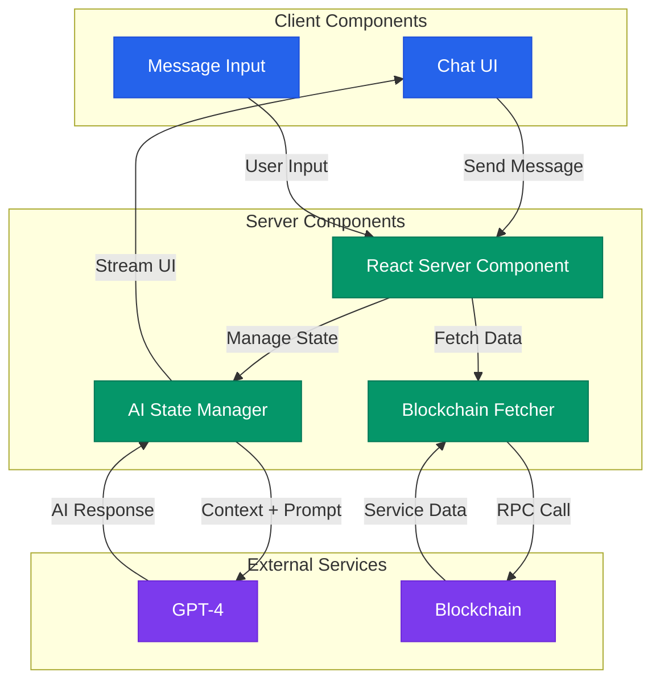

```mermaid
graph TD
subgraph "Client Components"
CUI[Chat UI]
MSG[Message Input]
end

    subgraph "Server Components"
        RSC[React Server Component]
        AI[AI State Manager]
        BF[Blockchain Fetcher]
    end

    subgraph "External Services"
        GPT[GPT-4]
        BC[Blockchain]
    end

    %% Client to Server flow
    CUI -->|"Send Message"| RSC
    MSG -->|"User Input"| RSC

    %% Server Component flow
    RSC -->|"Manage State"| AI
    RSC -->|"Fetch Data"| BF

    %% External Service Integration
    BF -->|"RPC Call"| BC
    AI -->|"Context + Prompt"| GPT
    BC -->|"Service Data"| BF
    GPT -->|"AI Response"| AI

    %% Stream back to client
    AI -->|"Stream UI"| CUI

    classDef client fill:#2563eb,stroke:#1d4ed8,color:white
    classDef server fill:#059669,stroke:#047857,color:white
    classDef external fill:#7c3aed,stroke:#6d28d9,color:white

    class CUI,MSG client
    class RSC,AI,BF server
    class GPT,BC external

```
