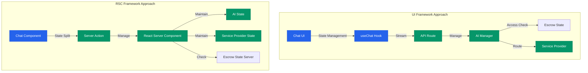

```mermaid
graph TD
subgraph "UI Framework Approach"
CUI[Chat UI]
CH[useChat Hook]
AR[API Route]
AM[AI Manager]
SP[Service Provider]
ES[Escrow State]

        CUI -->|"State Management"| CH
        CH -->|"Stream"| AR
        AR -->|"Manage"| AM
        AM -->|"Access Check"| ES
        AM -->|"Route"| SP
    end

    subgraph "RSC Framework Approach"
        RSCC[Chat Component]
        SA[Server Action]
        RSC[React Server Component]
        AIS[AI State]
        SPS[Service Provider State]
        ESS[Escrow State Server]

        RSCC -->|"State Split"| SA
        SA -->|"Manage"| RSC
        RSC -->|"Maintain"| AIS
        RSC -->|"Maintain"| SPS
        RSC -->|"Check"| ESS
    end

    classDef client fill:#2563eb,stroke:#1d4ed8,color:white
    classDef server fill:#059669,stroke:#047857,color:white
    class CUI,CH,RSCC client
    class AR,AM,SP,SA,RSC,AIS,SPS server
```
