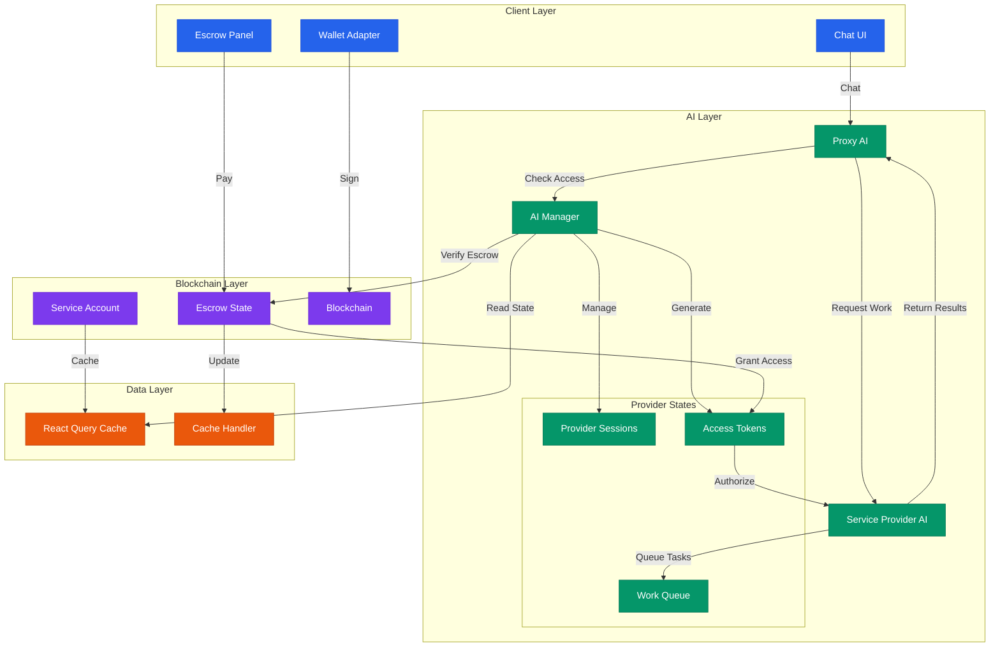

```mermaid
graph TD
subgraph "Client Layer"
CUI[Chat UI]
EP[Escrow Panel]
WA[Wallet Adapter]
end

    subgraph "AI Layer"
        PA[Proxy AI]
        SP[Service Provider AI]
        AM[AI Manager]
        subgraph "Provider States"
            PS[Provider Sessions]
            AT[Access Tokens]
            WQ[Work Queue]
        end
    end

    subgraph "Blockchain Layer"
        ES[Escrow State]
        SA[Service Account]
        BC[Blockchain]
    end

    subgraph "Data Layer"
        RQC[React Query Cache]
        CH[Cache Handler]
    end

    %% Client Interactions
    CUI -->|"Chat"| PA
    EP -->|"Pay"| ES
    WA -->|"Sign"| BC

    %% AI Flow
    PA -->|"Check Access"| AM
    AM -->|"Verify Escrow"| ES
    AM -->|"Manage"| PS
    AM -->|"Generate"| AT

    %% Provider Integration
    PA -->|"Request Work"| SP
    SP -->|"Queue Tasks"| WQ
    SP -->|"Return Results"| PA

    %% Data Management
    AM -->|"Read State"| RQC
    ES -->|"Update"| CH
    SA -->|"Cache"| RQC

    %% Access Control
    ES -->|"Grant Access"| AT
    AT -->|"Authorize"| SP

    classDef client fill:#2563eb,stroke:#1d4ed8,color:white
    classDef ai fill:#059669,stroke:#047857,color:white
    classDef blockchain fill:#7c3aed,stroke:#6d28d9,color:white
    classDef data fill:#ea580c,stroke:#c2410c,color:white

    class CUI,EP,WA client
    class PA,SP,AM,PS,AT,WQ ai
    class ES,SA,BC blockchain
    class RQC,CH data
```
