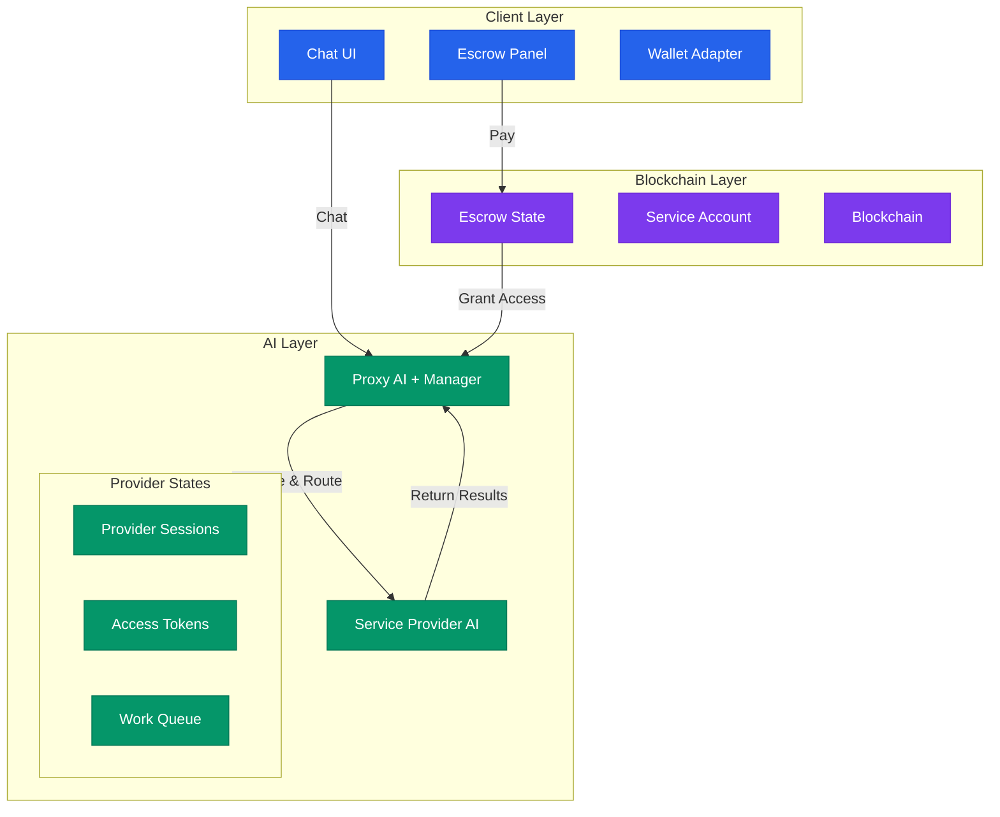

```mermaid
graph TD
    subgraph "Client Layer"
        CUI[Chat UI]
        EP[Escrow Panel]
        WA[Wallet Adapter]
    end

    subgraph "AI Layer"
        PAM[Proxy AI + Manager]
        SP[Service Provider AI]
        subgraph "Provider States"
            PS[Provider Sessions]
            AT[Access Tokens]
            WQ[Work Queue]
        end
    end

    subgraph "Blockchain Layer"
        ES[Escrow State]
        SA[Service Account]
        BC[Blockchain]
    end

    %% Simplified Flow
    CUI -->|"Chat"| PAM
    EP -->|"Pay"| ES
    ES -->|"Grant Access"| PAM
    PAM -->|"Manage & Route"| SP
    SP -->|"Return Results"| PAM

    classDef client fill:#2563eb,stroke:#1d4ed8,color:white
    classDef ai fill:#059669,stroke:#047857,color:white
    classDef blockchain fill:#7c3aed,stroke:#6d28d9,color:white

    class CUI,EP,WA client
    class PAM,SP,PS,AT,WQ ai
    class ES,SA,BC blockchain
```
