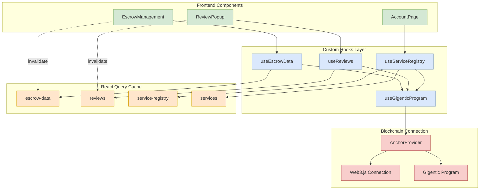

```mermaid
graph TD
    subgraph "Frontend Components"
        EC[EscrowManagement]
        RP[ReviewPopup]
        AP[AccountPage]
    end

    subgraph "Custom Hooks Layer"
        EH[useEscrowData]
        RH[useReviews]
        SH[useServiceRegistry]
        GP[useGigenticProgram]
    end

    subgraph "React Query Cache"
        RC1["escrow-data"]
        RC2["reviews"]
        RC3["service-registry"]
        RC4["services"]
    end

    subgraph "Blockchain Connection"
        AnchorProvider
        Web3Connection[Web3.js Connection]
        Program[Gigentic Program]
    end

    %% Component to Hook connections
    EC --> EH
    RP --> RH
    AP --> SH

    %% Hook to Program connections
    EH --> GP
    RH --> GP
    SH --> GP

    %% Program setup
    GP --> AnchorProvider
    AnchorProvider --> Web3Connection
    AnchorProvider --> Program

    %% Cache connections
    EH --> RC1
    RH --> RC2
    SH --> RC3
    SH --> RC4

    %% Cache invalidation
    EC -.->|invalidate| RC1
    RP -.->|invalidate| RC2

    classDef component fill:#d4e8d4,stroke:#82b366
    classDef hook fill:#dae8fc,stroke:#6c8ebf
    classDef cache fill:#ffe6cc,stroke:#d79b00
    classDef blockchain fill:#f8cecc,stroke:#b85450

    class EC,RP,AP component
    class EH,RH,SH,GP hook
    class RC1,RC2,RC3,RC4 cache
    class AnchorProvider,Web3Connection,Program blockchain
```
