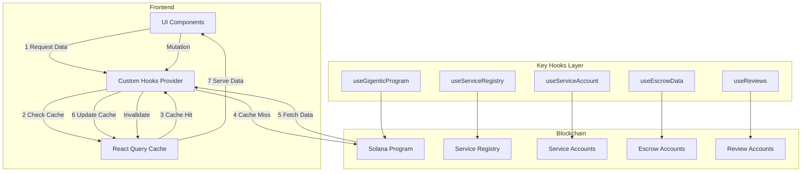

```mermaid
graph TD
    subgraph Frontend
        UI[UI Components]
        RC[React Query Cache]
        HP[Custom Hooks Provider]
    end

    subgraph Blockchain
        SP[Solana Program]
        SR[Service Registry]
        SA[Service Accounts]
        EA[Escrow Accounts]
        RA[Review Accounts]
    end

    %% Data flow connections
    UI --> |1 Request Data| HP
    HP --> |2 Check Cache| RC
    RC --> |3 Cache Hit| HP
    HP --> |4 Cache Miss| SP
    SP --> |5 Fetch Data| HP
    HP --> |6 Update Cache| RC
    RC --> |7 Serve Data| UI

    %% Key hooks and their relationships
    subgraph "Key Hooks Layer"
        GH[useGigenticProgram]
        SRH[useServiceRegistry]
        SAH[useServiceAccount]
        EH[useEscrowData]
        RH[useReviews]
    end

    %% Hook connections
    GH --> SP
    SRH --> SR
    SAH --> SA
    EH --> EA
    RH --> RA

    %% Cache invalidation
    UI --> |Mutation| HP
    HP --> |Invalidate| RC

```
