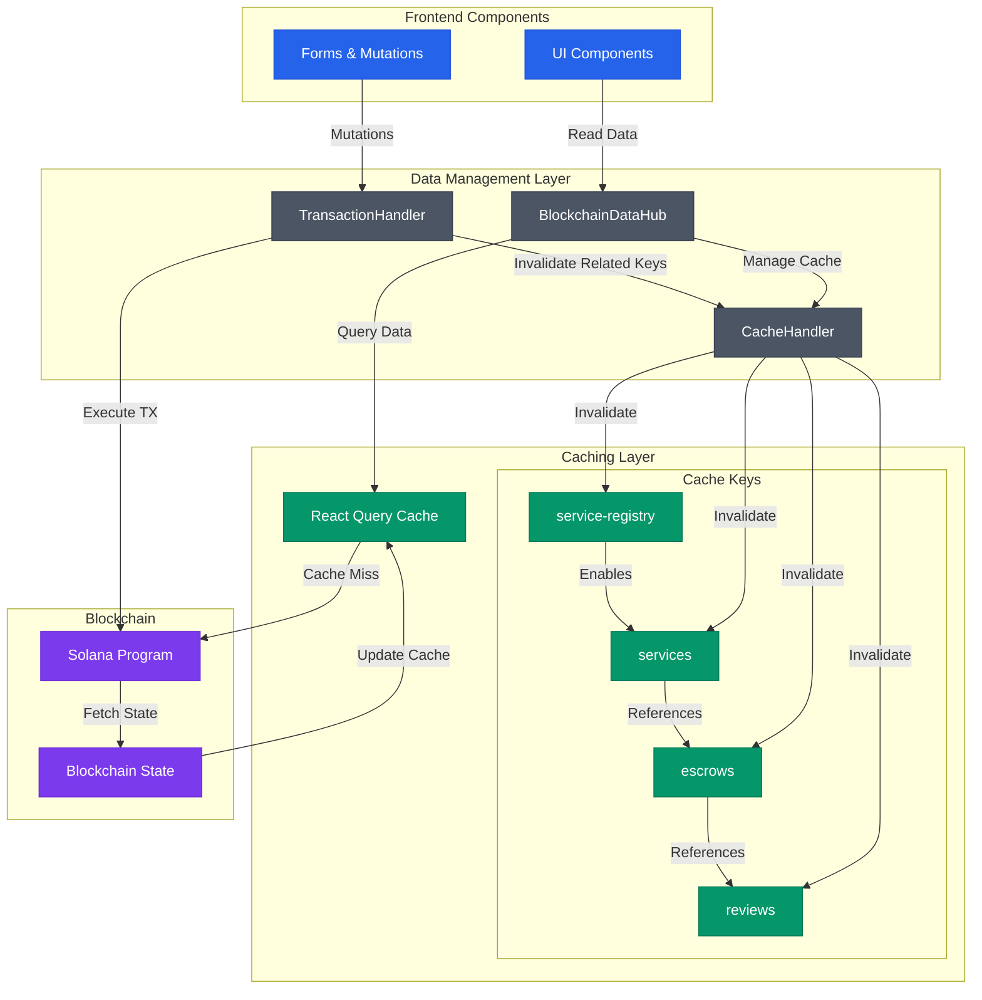

```mermaid
graph TD
    subgraph "Frontend Components"
        UI[UI Components]
        Forms[Forms & Mutations]
    end

    subgraph "Data Management Layer"
        BDH[BlockchainDataHub]
        CH[CacheHandler]
        TH[TransactionHandler]
    end

    subgraph "Caching Layer"
        RQC[React Query Cache]
        subgraph "Cache Keys"
            SK["service-registry"]
            SAK["services"]
            EK["escrows"]
            RK["reviews"]
        end
    end

    subgraph "Blockchain"
        SP[Solana Program]
        BC[Blockchain State]
    end

    %% Component to Data Hub connections
    UI -->|"Read Data"| BDH
    Forms -->|"Mutations"| TH

    %% Data Hub to Cache connections
    BDH -->|"Query Data"| RQC
    BDH -->|"Manage Cache"| CH

    %% Cache Handler operations
    CH -->|"Invalidate"| SK
    CH -->|"Invalidate"| SAK
    CH -->|"Invalidate"| EK
    CH -->|"Invalidate"| RK

    %% Transaction Handler flow
    TH -->|"Execute TX"| SP
    TH -->|"Invalidate Related Keys"| CH

    %% Cache to Blockchain connections
    RQC -->|"Cache Miss"| SP
    SP -->|"Fetch State"| BC
    BC -->|"Update Cache"| RQC

    %% Cache key relationships
    SK -->|"Enables"| SAK
    SAK -->|"References"| EK
    EK -->|"References"| RK

    classDef primary fill:#2563eb,stroke:#1d4ed8,color:white
    classDef secondary fill:#4b5563,stroke:#374151,color:white
    classDef cache fill:#059669,stroke:#047857,color:white
    classDef blockchain fill:#7c3aed,stroke:#6d28d9,color:white

    class UI,Forms primary
    class BDH,CH,TH secondary
    class RQC,SK,SAK,EK,RK cache
    class SP,BC blockchain
```
