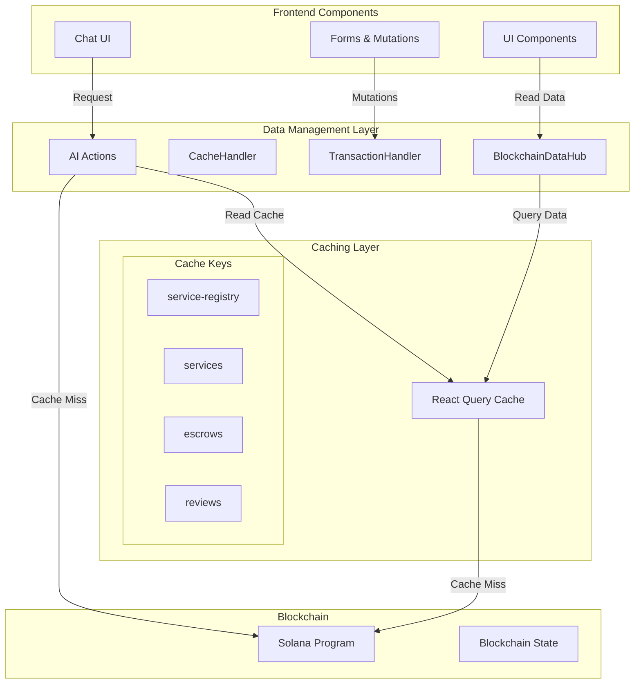

```mermaid
graph TD
    subgraph "Frontend Components"
        UI[UI Components]
        Forms[Forms & Mutations]
        Chat[Chat UI]
    end

    subgraph "Data Management Layer"
        BDH[BlockchainDataHub]
        CH[CacheHandler]
        TH[TransactionHandler]
        AI[AI Actions]
    end

    subgraph "Caching Layer"
        RQC[React Query Cache]
        subgraph "Cache Keys"
            SK["service-registry"]
            SAK["services"]
            EK["escrows"]
            RK["reviews"]
        end
    end

    subgraph "Blockchain"
        SP[Solana Program]
        BC[Blockchain State]
    end

    %% New AI Integration flows
    Chat -->|"Request"| AI
    AI -->|"Read Cache"| RQC
    AI -->|"Cache Miss"| SP

    %% Existing flows remain the same
    UI -->|"Read Data"| BDH
    Forms -->|"Mutations"| TH
    BDH -->|"Query Data"| RQC
    RQC -->|"Cache Miss"| SP
```
