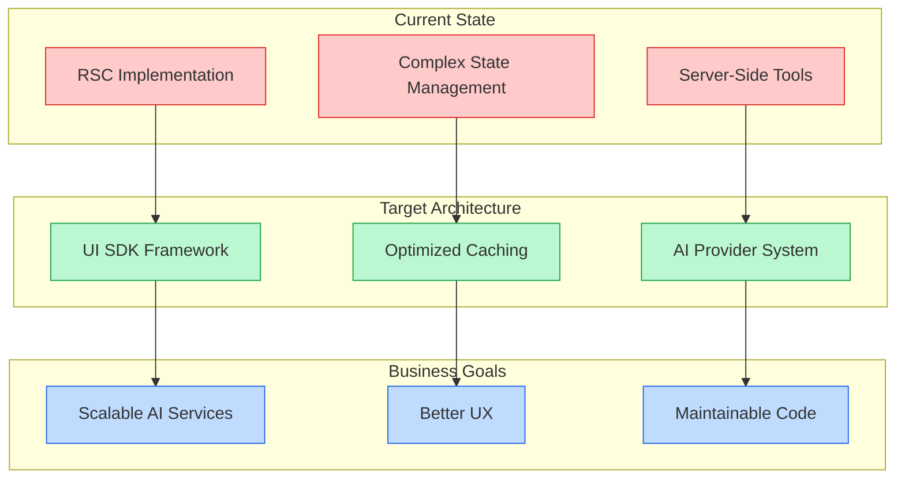

```mermaid
graph TD
    subgraph "Current State"
        A[RSC Implementation]
        B[Complex State Management]
        C[Server-Side Tools]
    end

    subgraph "Target Architecture"
        D[UI SDK Framework]
        E[Optimized Caching]
        F[AI Provider System]
    end

    subgraph "Business Goals"
        G[Scalable AI Services]
        H[Better UX]
        I[Maintainable Code]
    end

    A --> D
    B --> E
    C --> F
    D --> G
    E --> H
    F --> I

    classDef current fill:#fecaca,stroke:#dc2626
    classDef target fill:#bbf7d0,stroke:#16a34a
    classDef goals fill:#bfdbfe,stroke:#2563eb

    class A,B,C current
    class D,E,F target
    class G,H,I goals
```
