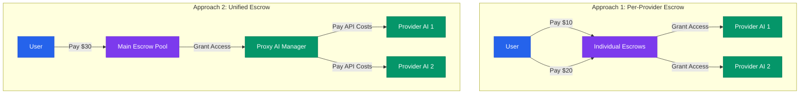

```mermaid
graph TD
    subgraph "Approach 1: Per-Provider Escrow"
        E1[Individual Escrows]
        P1[Provider AI 1]
        P2[Provider AI 2]
        U1[User]

        U1 -->|"Pay $10"| E1
        E1 -->|"Grant Access"| P1
        U1 -->|"Pay $20"| E1
        E1 -->|"Grant Access"| P2
    end

    subgraph "Approach 2: Unified Escrow"
        E2[Main Escrow Pool]
        PAM[Proxy AI Manager]
        PA1[Provider AI 1]
        PA2[Provider AI 2]
        U2[User]

        U2 -->|"Pay $30"| E2
        E2 -->|"Grant Access"| PAM
        PAM -->|"Pay API Costs"| PA1
        PAM -->|"Pay API Costs"| PA2
    end

    classDef user fill:#2563eb,stroke:#1d4ed8,color:white
    classDef escrow fill:#7c3aed,stroke:#6d28d9,color:white
    classDef ai fill:#059669,stroke:#047857,color:white

    class U1,U2 user
    class E1,E2 escrow
    class P1,P2,PAM,PA1,PA2 ai
```
