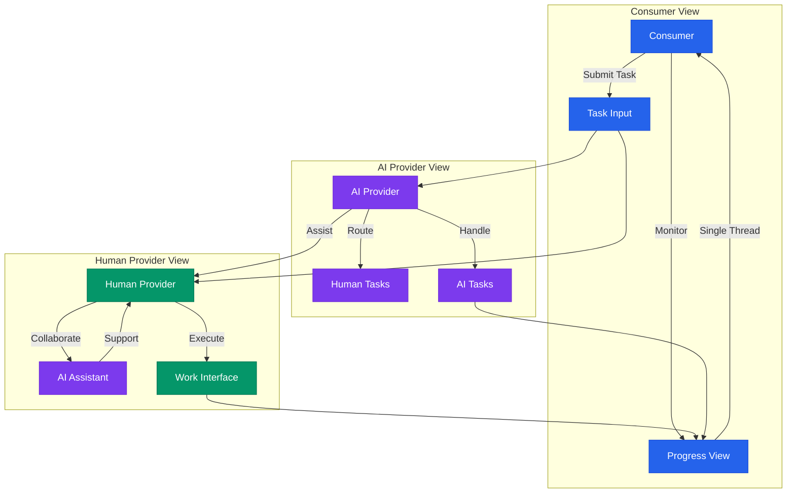

## I like this "hybrid solution". How can you imagine this to work from the 3 participants point of view (consumer, human provider, AI provider)?

Here's a breakdown of the hybrid solution from each participant's perspective:



### 1. Consumer Experience

```typescript
// Example consumer interaction
interface HybridTaskFlow {
  async submitTask() {
    // Single point of entry
    const task = await TaskCreator.create({
      description: "Build me a React component with animations",
      requirements: [...],
      budget: 100,
    });

    // Gets unified updates from both human and AI
    task.onUpdate((update) => {
      switch(update.type) {
        case 'ai_suggestion':
          showAIFeedback(update);
        case 'human_milestone':
          showHumanProgress(update);
        case 'completion':
          showFinalResult(update);
      }
    });
  }
}
```

### 2. Human Provider Experience

```typescript
interface HybridProviderDashboard {
  // AI-enhanced workflow
  async handleTask(task: Task) {
    // Get AI assistance while working
    const aiSupport = await this.aiAssistant.analyze({
      task,
      suggestApproach: true,
      provideTemplates: true,
      estimateEffort: true
    });

    // Work with AI pair programmer
    const workSession = await this.createSession({
      task,
      aiAssistant: true,
      realTimeSupport: true
    });

    // Submit work with AI quality check
    await this.submitWork({
      work: workSession.result,
      aiReview: true
    });
  }
}
```

### 3. AI Provider Experience

```typescript
class HybridAIProvider {
  async processTask(task: Task) {
    // Determine task complexity
    const analysis = await this.analyzeTask(task);

    if (analysis.needsHumanInput) {
      // Route to human provider with AI support
      return this.routeToHumanProvider(task, {
        aiSupport: {
          codeGeneration: true,
          qualityChecks: true,
          suggestions: true,
        },
      });
    } else {
      // Handle directly with human oversight
      return this.handleWithHumanOversight(task);
    }
  }

  async assistHumanProvider(provider: HumanProvider) {
    return {
      realTimeSupport: this.providePairProgramming(),
      qualityAssurance: this.reviewCode(),
      suggestions: this.provideSuggestions(),
    };
  }
}
```

### Example Scenarios:

1. **Code Development Task**:

```typescript
// Consumer sees:
- Single chat thread
- AI-generated initial code
- Human provider refinements
- Real-time AI suggestions
- Final human-verified result

// Human provider sees:
- AI-generated starter code
- Real-time AI pair programming
- Code quality checks
- Suggestion panel

// AI provider:
- Generates initial code
- Assists human provider
- Reviews final code
- Suggests optimizations
```

2. **Design Task**:

```typescript
// Consumer sees:
- AI-generated mockups
- Human designer iterations
- AI-suggested variations
- Final human-polished design

// Human provider sees:
- AI-generated inspiration
- Style suggestions
- Component library
- Automated asset generation

// AI provider:
- Generates initial concepts
- Provides design assets
- Suggests improvements
- Handles asset optimization
```

### Key Benefits:

1. **For Consumer**:

- Faster initial results
- Higher quality final output
- Cost-effective solution
- Single point of contact

2. **For Human Provider**:

- AI-enhanced productivity
- Reduced repetitive work
- Better quality assurance
- Focus on creative aspects

3. **For AI Provider**:

- Human oversight for quality
- Better task completion rate
- Learning from human input
- Optimal resource usage

Would you like me to elaborate on any of these aspects or provide more specific implementation examples?
