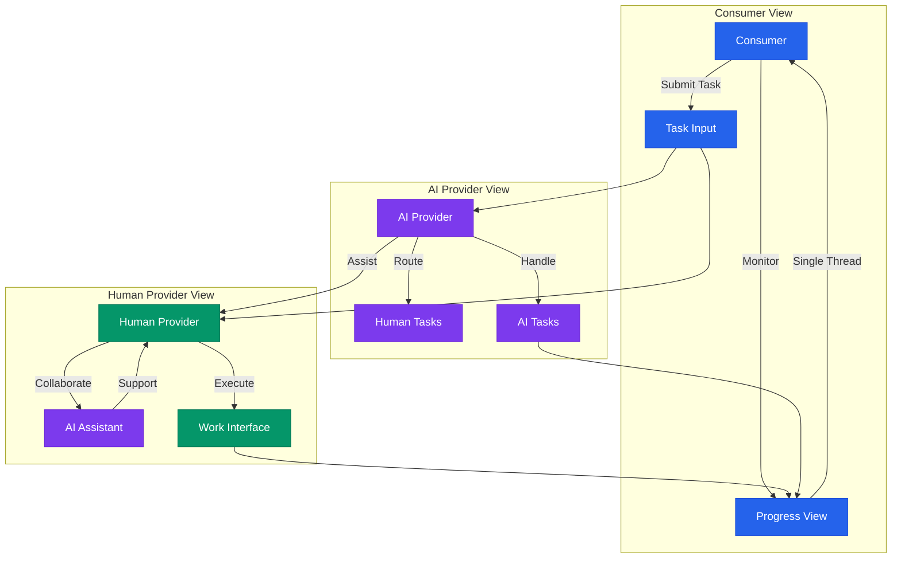

```mermaid
graph TD
    subgraph "Consumer View"
        C[Consumer]
        T[Task Input]
        P[Progress View]

        C -->|"Submit Task"| T
        C -->|"Monitor"| P
        P -->|"Single Thread"| C
    end

    subgraph "Human Provider View"
        HP[Human Provider]
        AI[AI Assistant]
        W[Work Interface]

        HP -->|"Collaborate"| AI
        HP -->|"Execute"| W
        AI -->|"Support"| HP
    end

    subgraph "AI Provider View"
        AP[AI Provider]
        HT[Human Tasks]
        AT[AI Tasks]

        AP -->|"Handle"| AT
        AP -->|"Route"| HT
        AP -->|"Assist"| HP
    end

    T --> HP
    T --> AP
    W --> P
    AT --> P

    classDef consumer fill:#2563eb,stroke:#1d4ed8,color:white
    classDef human fill:#059669,stroke:#047857,color:white
    classDef ai fill:#7c3aed,stroke:#6d28d9,color:white

    class C,T,P consumer
    class HP,W human
    class AP,AI,HT,AT ai
```
