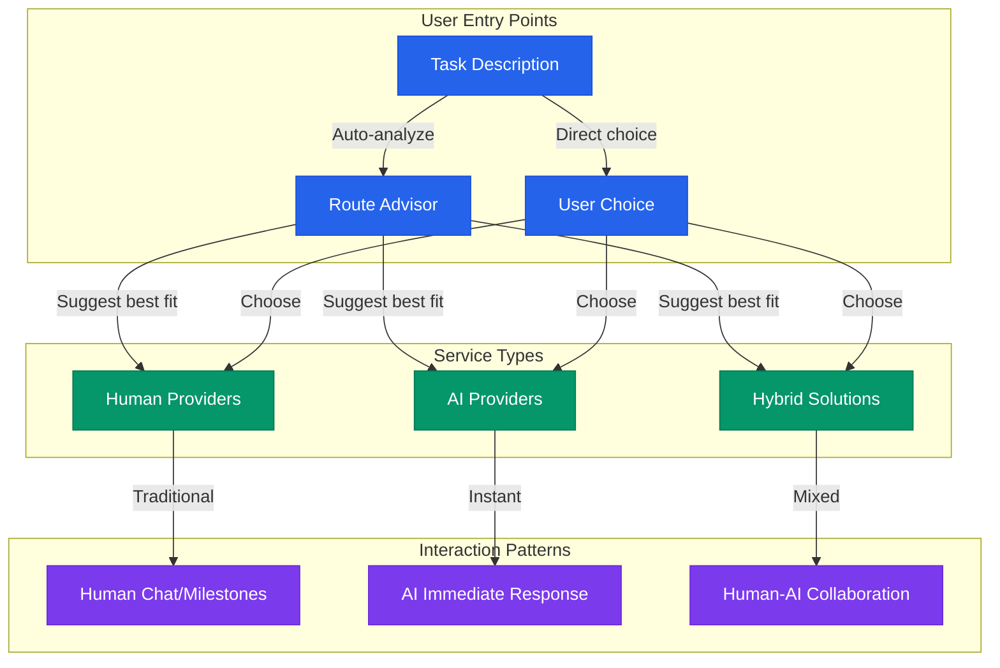

```mermaid
graph TD
    subgraph "User Entry Points"
        T[Task Description]
        T -->|Auto-analyze| RA[Route Advisor]
        T -->|Direct choice| UC[User Choice]
    end

    subgraph "Service Types"
        H[Human Providers]
        AI[AI Providers]
        HY[Hybrid Solutions]
    end

    subgraph "Interaction Patterns"
        HC[Human Chat/Milestones]
        AC[AI Immediate Response]
        HA[Human-AI Collaboration]
    end

    RA -->|Suggest best fit| H
    RA -->|Suggest best fit| AI
    RA -->|Suggest best fit| HY

    UC -->|Choose| H
    UC -->|Choose| AI
    UC -->|Choose| HY

    H -->|Traditional| HC
    AI -->|Instant| AC
    HY -->|Mixed| HA

    classDef entry fill:#2563eb,stroke:#1d4ed8,color:white
    classDef service fill:#059669,stroke:#047857,color:white
    classDef pattern fill:#7c3aed,stroke:#6d28d9,color:white

    class T,RA,UC entry
    class H,AI,HY service
    class HC,AC,HA pattern
```
