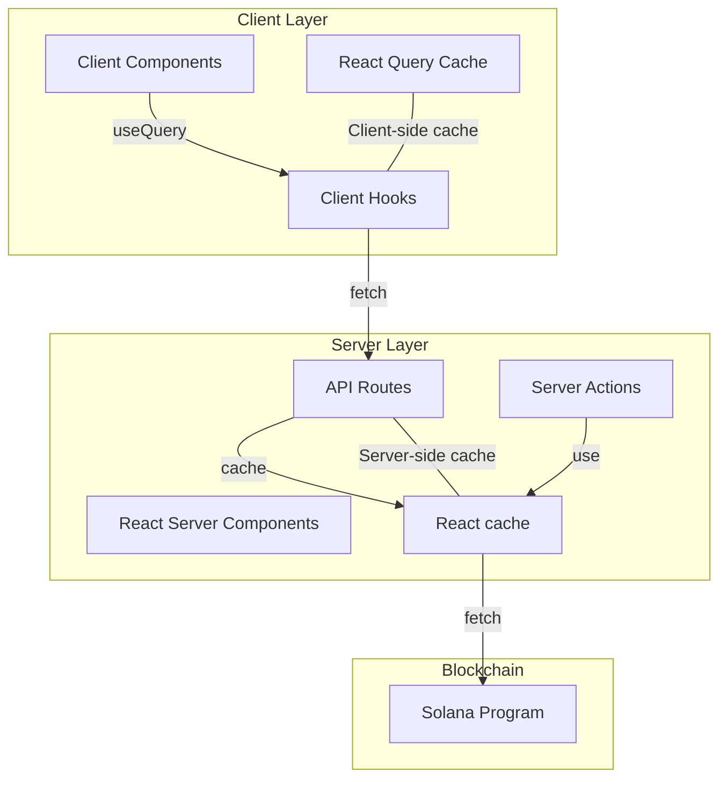

```mermaid
graph TD
    subgraph "Client Layer"
        CC[Client Components]
        RQC[React Query Cache]
        CH[Client Hooks]
    end

    subgraph "Server Layer"
        API[API Routes]
        SA[Server Actions]
        RSC[React Server Components]
        RC[React cache]
    end

    subgraph "Blockchain"
        SP[Solana Program]
    end

    CC -->|useQuery| CH
    CH -->|fetch| API
    API -->|cache| RC
    RC -->|fetch| SP
    SA -->|use| RC

    RQC ---|"Client-side cache"| CH
    RC ---|"Server-side cache"| API
```
