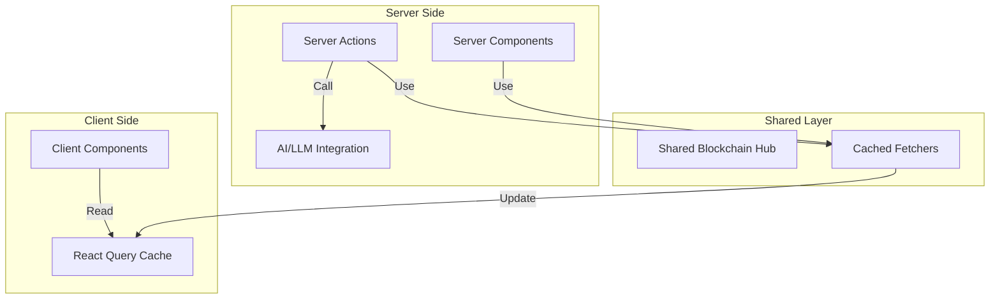

```mermaid
graph TD
    subgraph "Client Side"
        CC[Client Components]
        RQC[React Query Cache]
    end

    subgraph "Server Side"
        SA[Server Actions]
        SC[Server Components]
        AI[AI/LLM Integration]
    end

    subgraph "Shared Layer"
        SBH[Shared Blockchain Hub]
        CF[Cached Fetchers]
    end

    CC -->|Read| RQC
    SA -->|Use| CF
    SC -->|Use| CF
    CF -->|Update| RQC
    SA -->|Call| AI
```
