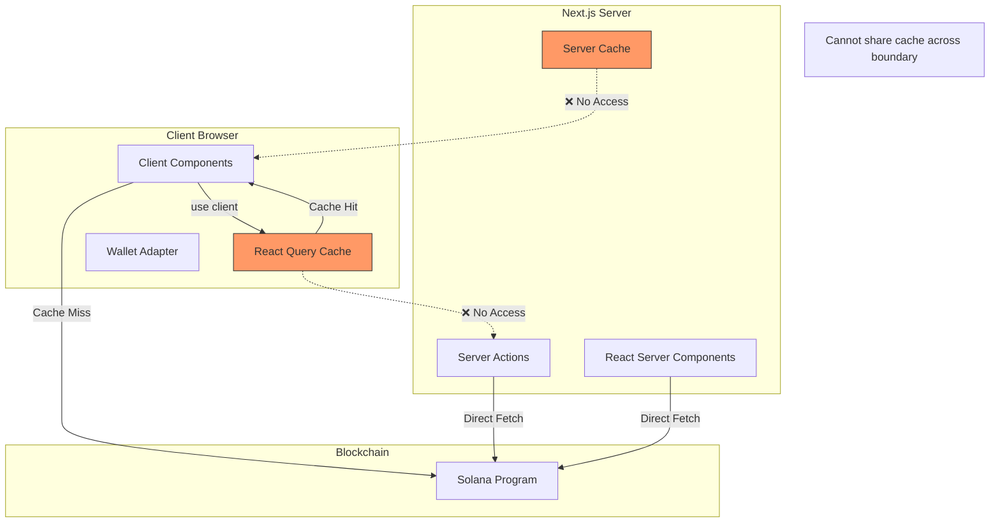

```mermaid
graph TD
    subgraph "Client Browser"
        CC[Client Components]
        RQC[React Query Cache]
        WA[Wallet Adapter]
    end

    subgraph "Next.js Server"
        RSC[React Server Components]
        SA[Server Actions]
        SC[Server Cache]
    end

    subgraph "Blockchain"
        SP[Solana Program]
    end

    CC -->|"use client"| RQC
    RQC -->|Cache Hit| CC
    CC -->|Cache Miss| SP

    SA -->|Direct Fetch| SP
    RSC -->|Direct Fetch| SP

    style RQC fill:#f96,stroke:#333
    style SC fill:#f96,stroke:#333

    %% Add warning notes
    note[Cannot share cache across boundary]

    RQC -.->|❌ No Access| SA
    SC -.->|❌ No Access| CC
```
