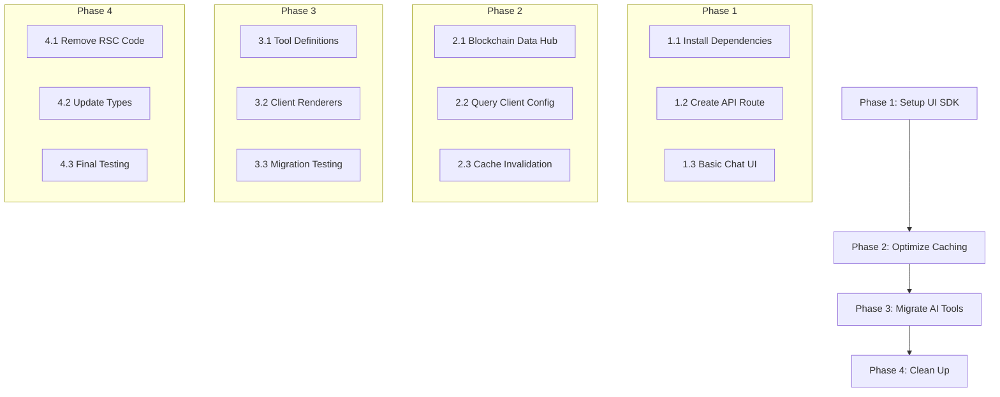

```mermaid
graph TD
    A[Phase 1: Setup UI SDK] --> B[Phase 2: Optimize Caching]
    B --> C[Phase 3: Migrate AI Tools]
    C --> D[Phase 4: Clean Up]

    subgraph "Phase 1"
        A1[1.1 Install Dependencies]
        A2[1.2 Create API Route]
        A3[1.3 Basic Chat UI]
    end

    subgraph "Phase 2"
        B1[2.1 Blockchain Data Hub]
        B2[2.2 Query Client Config]
        B3[2.3 Cache Invalidation]
    end

    subgraph "Phase 3"
        C1[3.1 Tool Definitions]
        C2[3.2 Client Renderers]
        C3[3.3 Migration Testing]
    end

    subgraph "Phase 4"
        D1[4.1 Remove RSC Code]
        D2[4.2 Update Types]
        D3[4.3 Final Testing]
    end
```
