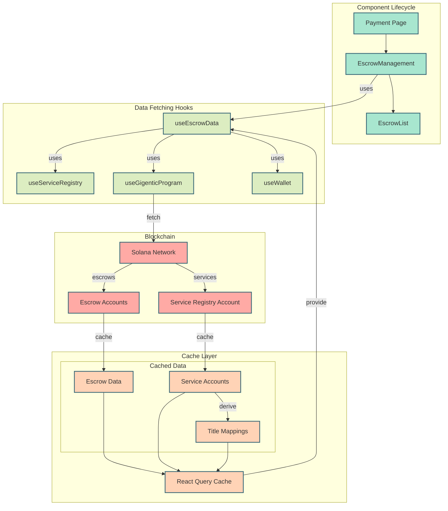

```mermaid
graph TD
    subgraph "Component Lifecycle"
        PP[Payment Page]
        EM[EscrowManagement]
        EL[EscrowList]
    end

    subgraph "Data Fetching Hooks"
        UED[useEscrowData]
        USR[useServiceRegistry]
        UGP[useGigenticProgram]
        UW[useWallet]
    end

    subgraph "Cache Layer"
        RQC[React Query Cache]
        subgraph "Cached Data"
            ED[Escrow Data]
            SA[Service Accounts]
            TM[Title Mappings]
        end
    end

    subgraph "Blockchain"
        BC[Solana Network]
        EA[Escrow Accounts]
        SRA[Service Registry Account]
    end

    %% Component Flow
    PP --> EM
    EM --> EL

    %% Hook Dependencies
    EM -->|uses| UED
    UED -->|uses| USR
    UED -->|uses| UGP
    UED -->|uses| UW

    %% Data Flow
    UGP -->|fetch| BC
    BC -->|escrows| EA
    BC -->|services| SRA

    %% Cache Management
    EA -->|cache| ED
    SRA -->|cache| SA
    SA -->|derive| TM

    %% Query Cache
    ED --> RQC
    SA --> RQC
    TM --> RQC
    RQC -->|provide| UED

    classDef component fill:#a8e6cf,stroke:#3b6978,stroke-width:2px;
    classDef hook fill:#dcedc1,stroke:#3b6978,stroke-width:2px;
    classDef cache fill:#ffd3b6,stroke:#3b6978,stroke-width:2px;
    classDef blockchain fill:#ffaaa5,stroke:#3b6978,stroke-width:2px;

    class PP,EM,EL component;
    class UED,USR,UGP,UW hook;
    class RQC,ED,SA,TM cache;
    class BC,EA,SRA blockchain;
```
