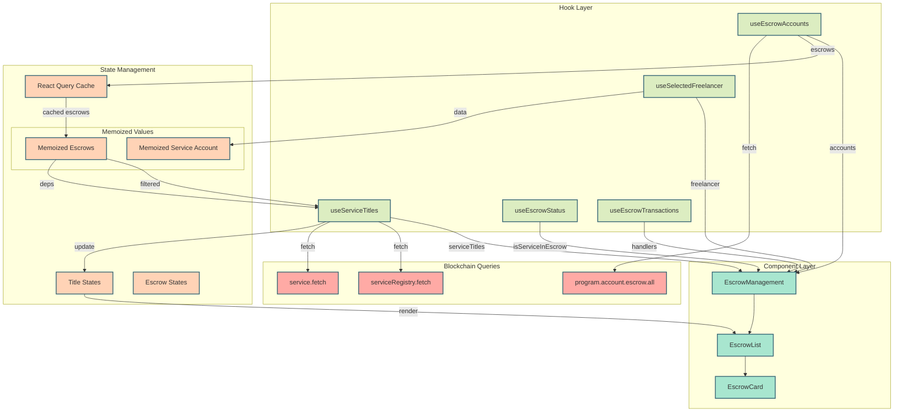

```mermaid
graph TD
    subgraph "Component Layer"
        EM[EscrowManagement]
        EL[EscrowList]
        EC[EscrowCard]
    end

    subgraph "Hook Layer"
        EA[useEscrowAccounts]
        ST[useServiceTitles]
        ES[useEscrowStatus]
        ET[useEscrowTransactions]
        SF[useSelectedFreelancer]
    end

    subgraph "State Management"
        RQ[React Query Cache]
        TS[Title States]
        ESt[Escrow States]
        subgraph "Memoized Values"
            ME[Memoized Escrows]
            MSA[Memoized Service Account]
        end
    end

    subgraph "Blockchain Queries"
        EAQ[program.account.escrow.all]
        SRQ[serviceRegistry.fetch]
        SAQ[service.fetch]
    end

    %% Component Relationships
    EM --> EL
    EL --> EC

    %% Hook Dependencies
    EA -->|accounts| EM
    ST -->|serviceTitles| EM
    ES -->|isServiceInEscrow| EM
    ET -->|handlers| EM
    SF -->|freelancer| EM

    %% State Flow
    EA -->|escrows| RQ
    RQ -->|cached escrows| ME
    ME -->|filtered| ST
    SF -->|data| MSA

    %% Blockchain Query Flow
    EA -->|fetch| EAQ
    ST -->|fetch| SRQ
    ST -->|fetch| SAQ

    %% Update Cycles
    ME -->|deps| ST
    ST -->|update| TS
    TS -->|render| EL

    classDef component fill:#a8e6cf,stroke:#3b6978,stroke-width:2px;
    classDef hook fill:#dcedc1,stroke:#3b6978,stroke-width:2px;
    classDef state fill:#ffd3b6,stroke:#3b6978,stroke-width:2px;
    classDef query fill:#ffaaa5,stroke:#3b6978,stroke-width:2px;

    class EM,EL,EC component;
    class EA,ST,ES,ET,SF hook;
    class RQ,TS,ESt,ME,MSA state;
    class EAQ,SRQ,SAQ query;
```
