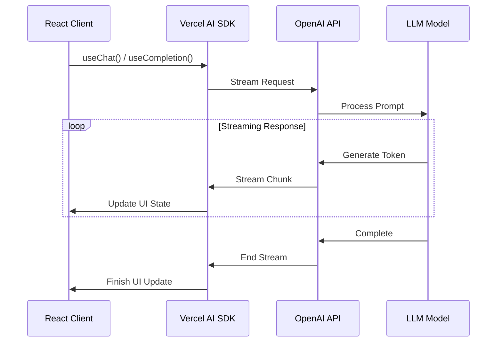
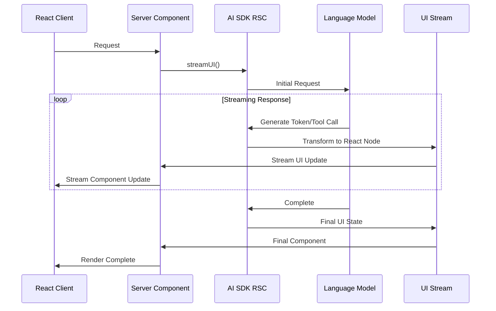
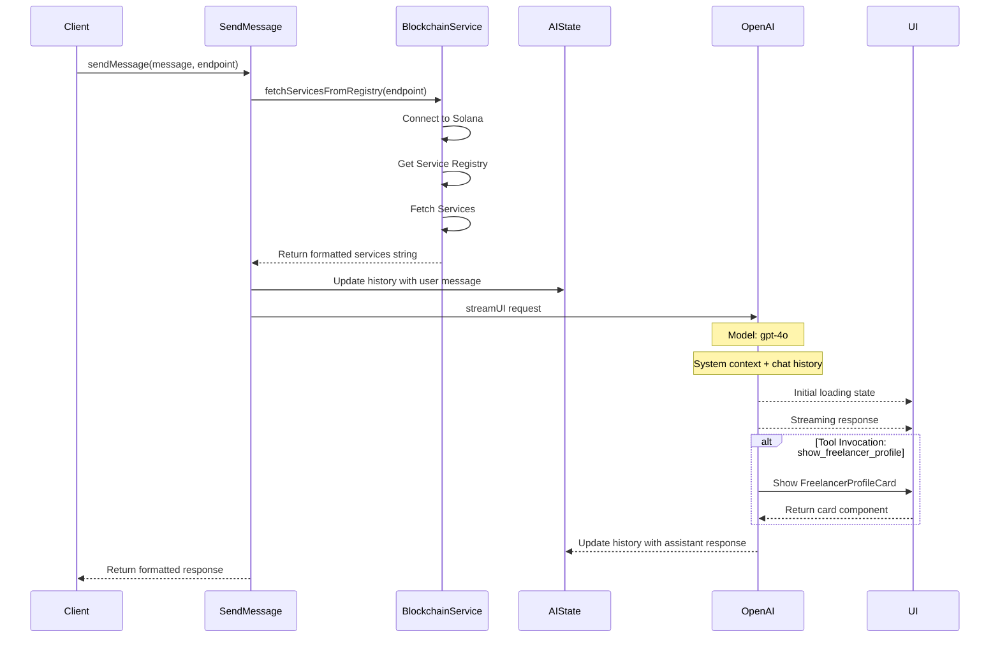

## Q: How does the Vercel AI SDK work?

_How does it call the backend endpoint? What is the flow? Is it built in? I don't see any POST call to any endpoint in the code._

Let me explain how the Vercel AI SDK works in this application. The flow involves several components working together:

1. **Frontend Initialization**:

```typescript
              <AI>
                <UiLayout links={links}>{children}</UiLayout>
              </AI>
```

The application wraps the entire app with the `AI` provider component, which sets up the AI context.

2. **AI Actions Definition**:

```typescript
export async function sendMessage(message: string): Promise<{
  id: number;
  role: 'user' | 'assistant';
  display: ReactNode;
}> {
  const history = getMutableAIState<typeof AI>();

  try {
    // provide the service registry as context to the LLM
    content = await fetchServiceRegistry();

    history.update([
      ...history.get(),
      {
        role: 'user',
        content: message,
      },
    ]);

    // call the LLM
    const reply = await streamUI({
      model: openai('gpt-4o'),
      messages: [
        {
          role: 'system',
          content,
          toolInvocations: [],
        },
        ...history.get(),
      ] as CoreMessage[],
      initial: (
        <BotMessage className="items-center flex shrink-0 select-none justify-center">
          <Loader2 className="w-5 animate-spin stroke-zinc-500" />
        </BotMessage>
      ),
      text: ({ content, done }) => {
        if (done) {
          history.done([
            ...history.get(),
            { role: 'assistant', content: content },
          ]);
        }

        // Format the content for display
        const formattedContent = content
          .replace(
            /(\d+\.\s\*\*(.*?)\*\*:)/g,
            (match, p1, p2) => `<strong>${p2}:</strong>`,
          )
          .replace(
            /(\*\*(.*?)\*\*)/g,
            (match, p1, p2) => `<strong>${p2}</strong>`,
          )
          .replace(/\n/g, '<br />');

        return (
          <BotMessage>
            <span dangerouslySetInnerHTML={{ __html: formattedContent }} />
          </BotMessage>
        );
      },
      temperature: 0.0,
      tools: {
       ...
      },
    });

    return {
      id: Date.now(),
      role: 'assistant' as const,
      display: reply.value,
    };
  } catch (error) {
    console.error('Error in sendMessage:', error);
    throw error;
  }
}
```

The `sendMessage` action is defined as a server action that handles the chat functionality.

3. **Chat Component Integration**:

```typescript
const [messages, setMessages] = useUIState<typeof AI>();
const { sendMessage } = useActions<typeof AI>();
```

The chat component uses the `useActions` and `useUIState` hooks from `ai/rsc` to interact with the AI functionality.

The magic happens through the Vercel AI SDK's internal handling. Here's how it works:

1. When `sendMessage` is called from the chat component, the SDK automatically:

   - Manages the WebSocket connection for streaming
   - Handles the HTTP POST requests to your API endpoint
   - Manages the message state and streaming updates

2. The SDK uses the API route defined in:

```typescript
import { openai } from '@ai-sdk/openai';
import { streamText, convertToCoreMessages } from 'ai';

// Allow streaming responses up to 30 seconds
export const maxDuration = 30;

export async function POST(req: Request) {
  const { messages } = await req.json();

  const result = await streamText({
    model: openai('gpt-4o-mini'),
    messages: convertToCoreMessages(messages),
  });

  return result.toDataStreamResponse();
}
```

You don't see explicit POST calls because the Vercel AI SDK abstracts this away through its `streamText` and `createAI` utilities. The SDK automatically:

- Creates a streaming connection to your API endpoint
- Handles message formatting and conversion
- Manages the real-time updates to your UI
- Handles error states and reconnection logic

The flow works like this:

1. User types a message
2. `sendMessage` action is triggered
3. The SDK automatically makes a POST request to `/api/chat`
4. The API route processes the request using the OpenAI client
5. The response is streamed back to the client
6. The UI updates in real-time with the streamed response

This abstraction is one of the main benefits of using the Vercel AI SDK - it handles all the complex streaming and state management logic behind the scenes, allowing you to focus on building your application logic rather than dealing with the implementation details of real-time communication.

The SDK uses the `ai` package's built-in streaming capabilities and React Server Components to handle the communication between the frontend and backend seamlessly.

## AI SDK

Here's a TLDR of how OpenAI API works with Vercel AI SDK's streaming UI protocol:

1. **OpenAI API Core Flow**:

- Client sends a request to OpenAI API
- OpenAI processes it and returns a streaming response
- Each chunk contains delta text updates
- Stream continues until completion or error

2. **Vercel AI SDK Integration**:

- Provides unified interface via `useChat` and `useCompletion` hooks
- Handles streaming state management automatically
- Implements backpressure and error handling
- Supports multiple model providers including OpenAI

Here's a mermaid diagram showing the flow:



Key features of the Vercel AI SDK Stream Protocol:

1. **Type-safe**: Full TypeScript support
2. **Framework agnostic**: Works with React, Vue, Svelte etc.
3. **Standardized format**: Consistent streaming interface
4. **Built-in state management**: Handles loading, error states
5. **Backpressure handling**: Prevents memory issues
6. **Error recovery**: Automatic retries and error handling

[Source: Vercel AI SDK Documentation](https://sdk.vercel.ai/docs)

The protocol is designed to be simple to implement while providing robust streaming capabilities for AI applications. The SDK handles all the complexity of managing streaming state, backpressure, and error handling, letting developers focus on building their UI.

## AI SDK RSC

Here's a clear explanation of how Vercel AI SDK's RSC (React Server Components) functionality works:



Key Components:

1. **streamUI Function**:

- Entry point for RSC streaming
- Handles model interaction and UI generation
- Supports both text and tool calls
- Returns a streamable UI component

2. **State Management**:

- `createAI()`: Creates context provider for AI/UI state
- `getAIState()`: Reads AI state on server
- `getMutableAIState()`: Updates AI state on server
- `useAIState()`: Accesses AI state on client

3. **UI Streaming Protocol**:

```typescript
{
  value: ReactNode,       // Current UI state
  textStream: Stream,     // Raw text stream
  toolCalls: ToolCall[],  // Tool interactions
  toolResults: Result[],  // Tool execution results
  usage: TokenUsage      // Token consumption stats
}
```

4. **Key Features**:

- Server-side streaming of UI components
- Real-time UI updates without client-side JS
- Built-in tool calling support
- Automatic state synchronization
- Type-safe interactions

The main advantage is that it allows streaming UI updates directly from the server while maintaining React's component model and state management.

[Source: Vercel AI SDK RSC Documentation](https://sdk.vercel.ai/docs/reference/ai-sdk-rsc)

## Current Flow

I'll create a sequence diagram showing the main interactions in the `sendMessage` function and related components. Here's the diagram using Mermaid markdown:



This diagram shows:

1. Initial request flow from client to the `sendMessage` function
2. Blockchain interaction to fetch service registry data
3. State management with AIState
4. Streaming interaction with OpenAI
5. UI updates including the tool invocation flow
6. Final response back to client

The diagram highlights the asynchronous nature of the operations and the interaction between different components of the system.
