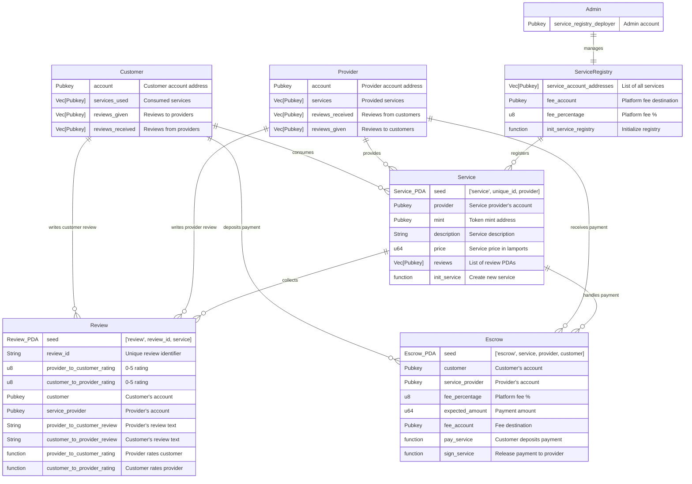

```mermaid
%%{init: {
  "theme": "default",
  "themeCSS": [
    ".er.relationshipLabel { fill: black; }",
    ".er.relationshipLabelBox { fill: white; }",
    ".er.entityBox { fill: lightgray; }",
    "[id^=entity-Customer] .er.entityBox { fill: lightgreen;} ",
    "[id^=entity-Provider] .er.entityBox { fill: lightgreen;} ",
    "[id^=entity-ServiceRegistry] .er.entityBox { fill: powderblue;} ",
    "[id^=entity-Service] .er.entityBox { fill: powderblue;} ",
    "[id^=entity-Escrow] .er.entityBox { fill: powderblue;} ",
    "[id^=entity-Review] .er.entityBox { fill: powderblue;} "
    ]
}}%%

erDiagram
    Customer ||--o{ Escrow : "deposits payment"
    Customer ||--o{ Service : "consumes"
    Customer ||--o{ Review : "writes customer review"

    Provider ||--o{ Escrow : "receives payment"
    Provider ||--o{ Service : "provides"
    Provider ||--o{ Review : "writes provider review"

    Service ||--o{ Review : "collects"
    Service ||--o{ Escrow : "handles payment"

    Admin ||--|| ServiceRegistry : "manages"

    ServiceRegistry ||--o{ Service : "registers"
    Admin {
        Pubkey service_registry_deployer "Admin account"
    }
    ServiceRegistry {
        Vec[Pubkey] service_account_addresses "List of all services"
        Pubkey fee_account "Platform fee destination"
        u8 fee_percentage "Platform fee %"
        function init_service_registry "Initialize registry"
    }
    Service {
        Service_PDA seed "['service', unique_id, provider]"
        Pubkey provider "Service provider's account"
        Pubkey mint "Token mint address"
        String description "Service description"
        u64 price "Service price in lamports"
        Vec[Pubkey] reviews "List of review PDAs"
        function init_service "Create new service"
    }
    Review {
        Review_PDA seed "['review', review_id, service]"
        String review_id "Unique review identifier"
        u8 provider_to_customer_rating "0-5 rating"
        u8 customer_to_provider_rating "0-5 rating"
        Pubkey customer "Customer's account"
        Pubkey service_provider "Provider's account"
        String provider_to_customer_review "Provider's review text"
        String customer_to_provider_review "Customer's review text"
        function provider_to_customer_rating "Provider rates customer"
        function customer_to_provider_rating "Customer rates provider"
    }
    Escrow {
        Escrow_PDA seed "['escrow', service, provider, customer]"
        Pubkey customer "Customer's account"
        Pubkey service_provider "Provider's account"
        u8 fee_percentage "Platform fee %"
        u64 expected_amount "Payment amount"
        Pubkey fee_account "Fee destination"
        function pay_service "Customer deposits payment"
        function sign_service "Release payment to provider"
    }
    Provider {
        Pubkey account "Provider account address"
        Vec[Pubkey] services "Provided services"
        Vec[Pubkey] reviews_received "Reviews from customers"
        Vec[Pubkey] reviews_given "Reviews to customers"
    }
    Customer {
        Pubkey account "Customer account address"
        Vec[Pubkey] services_used "Consumed services"
        Vec[Pubkey] reviews_given "Reviews to providers"
        Vec[Pubkey] reviews_received "Reviews from providers"
    }

```
