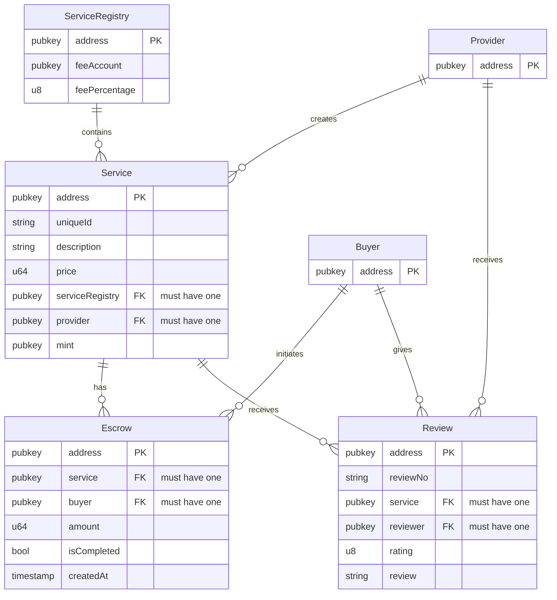

```mermaid
erDiagram
    ServiceRegistry ||--o{ Service : "contains"
    Service ||--o{ Escrow : "has"
    Service ||--o{ Review : "receives"
    Provider ||--o{ Service : "creates"
    Buyer ||--o{ Escrow : "initiates"
    Provider ||--o{ Review : "receives"
    Buyer ||--o{ Review : "gives"

    ServiceRegistry {
        pubkey address PK
        pubkey feeAccount
        u8 feePercentage
    }

    Service {
        pubkey address PK
        string uniqueId
        string description
        u64 price
        pubkey serviceRegistry FK "must have one"
        pubkey provider FK "must have one"
        pubkey mint
    }

    Escrow {
        pubkey address PK
        pubkey service FK "must have one"
        pubkey buyer FK "must have one"
        u64 amount
        bool isCompleted
        timestamp createdAt
    }

    Review {
        pubkey address PK
        string reviewNo
        pubkey service FK "must have one"
        pubkey reviewer FK "must have one"
        u8 rating
        string review
    }

    Provider {
        pubkey address PK
    }

    Buyer {
        pubkey address PK
    }
```
