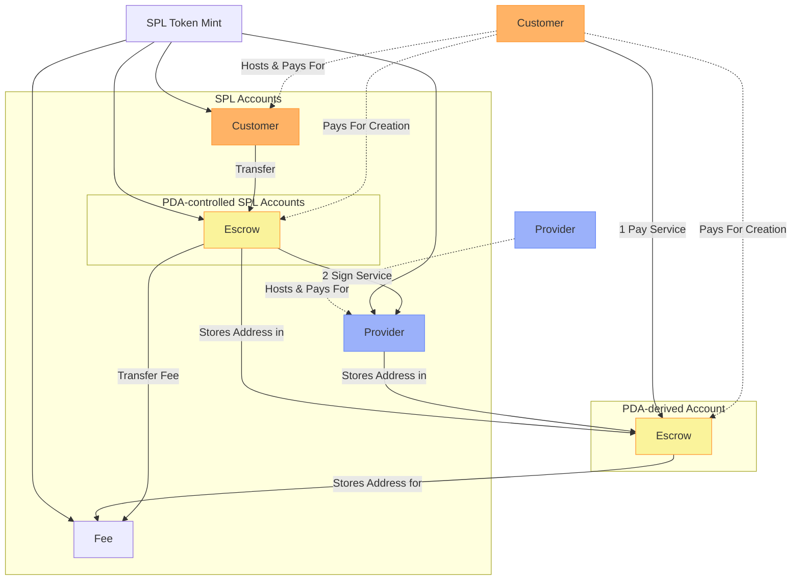

```mermaid
graph TD
    SP[Provider]:::providerStyle -.->|Hosts & Pays For| D
    M[SPL Token Mint]
    D[Provider]:::providerStyle
    A[Customer]:::customerStyle
    B[Escrow]:::escrowStyle
    C[Escrow]:::escrowStyle
    E[Fee]
    H[Customer]:::customerStyle

    M --> D
    M --> E
    M --> C
    M --> H

    A -->|1 Pay Service| B

    H -->|Transfer| C

    C -->|Stores Address in| B
    D -->|Stores Address in| B
    B -->|Stores Address for| E

    C -->|2 Sign Service| D
    C -->|Transfer Fee| E


    subgraph "PDA-derived Account"
        B
    end


    subgraph "SPL Accounts"
      subgraph "PDA-controlled SPL Accounts"
          C
      end
        D
        E
        H
    end

    classDef customerStyle fill:#ffb366,stroke:#ff9933
    classDef providerStyle fill:#9BB1FA,stroke:#698AF8
    classDef escrowStyle fill:#FAF39B,stroke:#ff9933
    classDef PDAStyle fill:#9BFA9B,stroke:#698AF8

    A -.->|Hosts & Pays For| H
    A -.->|Pays For Creation| B
    A -.->|Pays For Creation| C


```
