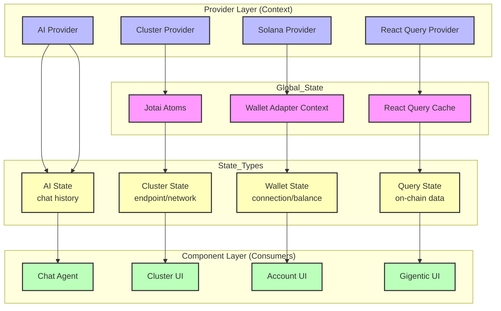

```mermaid
graph TB
subgraph Global_State
Jotai[Jotai Atoms]
ReactQuery[React Query Cache]
WalletAdapter[Wallet Adapter Context]
end

    subgraph Providers["Provider Layer (Context)"]
        AI[AI Provider]
        Cluster[Cluster Provider]
        Solana[Solana Provider]
        ReactQuery_Provider[React Query Provider]
    end

    subgraph State_Types
        direction LR
        ClusterState[Cluster State<br>endpoint/network]
        WalletState[Wallet State<br>connection/balance]
        AIState[AI State<br>chat history]
        QueryState[Query State<br>on-chain data]
    end

    subgraph Components["Component Layer (Consumers)"]
        AccountUI[Account UI]
        ChatAgent[Chat Agent]
        ClusterUI[Cluster UI]
        GigenticUI[Gigentic UI]
    end

    %% Connections
    Jotai --> ClusterState
    ReactQuery --> QueryState
    WalletAdapter --> WalletState
    AI --> AIState

    ClusterState --> ClusterUI
    WalletState --> AccountUI
    AIState --> ChatAgent
    QueryState --> GigenticUI

    %% Provider Relationships
    Cluster --> Jotai
    Solana --> WalletAdapter
    AI --> AIState
    ReactQuery_Provider --> ReactQuery

    %% Add styles
    classDef stateStore fill:#f9f,stroke:#333,stroke-width:2px;
    classDef provider fill:#bbf,stroke:#333,stroke-width:2px;
    classDef component fill:#bfb,stroke:#333,stroke-width:2px;
    classDef stateType fill:#ffb,stroke:#333,stroke-width:2px;

    class Jotai,ReactQuery,WalletAdapter stateStore;
    class AI,Cluster,Solana,ReactQuery_Provider provider;
    class AccountUI,ChatAgent,ClusterUI,GigenticUI component;
    class ClusterState,WalletState,AIState,QueryState stateType;
```
